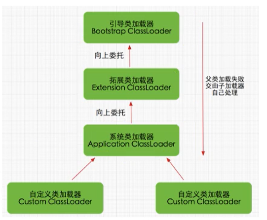

### 双亲委派机制

Java虚拟机对class文件采用的是按需加载的方式，只有需要的时候才会去加载class文件并在内存中（方法区）生成class对象

Java虚拟机采用的是双亲委派模式，即把请求加载class文件交由父类处理，它是一种任务委派模式。


### 工作原理

- 如果一个类加载器收到了类加载请求，它并不会自己先去加载，而是把这个请求委托给父类的加载器去执行；
- 如果父类加载器还存在其父类加载器，则进一步向上委托，依次递归，请求最终将到达顶层的启动类加载器；
- 如果父类加载器可以完成类加载任务，就成功返回，倘若父类加载器无法完成此加载任务，子加载器才会尝试自己去加载，这就是双亲委派模式。




### 双亲委派机制的优势

- 避免类的重复加载
- 保护程序安全，防止核心API被随意篡改
  - 自定义类：java.lang.String
  - 自定义类：java.lang.ShkStart（报错：阻止创建 java.lang开头的类）

```java
package java.lang;

public class String {

    static {
        System.out.println("自定义的String");
    }

    public static void main(String[] args) {
        String s = new String();
        System.out.println(s);
    }

}

编译失败
java: 程序包已存在于另一个模块中: java.base
```

