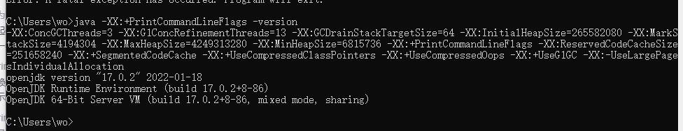
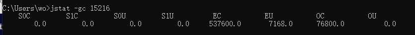
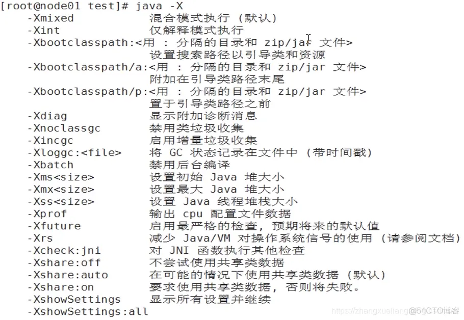

### JVM 内存参数设置

设置虚拟机栈内存大小（默认1024k)：-Xss1m

最小内存（默认1/64）：-Xms245M

最大内存（默认1/4）：-Xmx3614M

设置年轻代大小为5G（一般不用--设置了这个下面的NewRatio就失效了）：-Xmn5g

新生代与老年代在堆结构的占比（默认2）：-XX:NewRatio=2

设置 eden 和 S0/S1  空间的比例: （默认8）

-XX:SurvivorRatio=8  ---->  Eden：S0：S1 = 8:1:1

-XX:SurvivorRatio=4  ---->  Eden：S0：S1 = 4:1:1

新生代需要经历多少次GC晋升到老年代中的最大阈值（默认15）：-XX:MaxTenuringThreshold=15

一个计算期望存活大小的参数（默认50-）：-XX:TargetSurvivorRatio=50

对象在Survivor区大小占比超50%直接进入老年代


元空间：-XX:MetaspaceSize=1024m

最大元空间：-XX:MaxMetaspaceSize=128m


AdaptiveSizePolicy(自适应大小策略) ：Parallel GC 和G1 GC的情况下自动计算动态调整 Eden、From 和 To 区的大小

```shell
  开启：-XX:+UseAdaptiveSizePolicy
  关闭：-XX:-UseAdaptiveSizePolicy
```


```shell
# 方法区
-XX:MetaspaceSize / -XX:PermSize=256m 设置元空间/永久代初始值为256M
-XX:MaxMetaspaceSize / -XX:MaxPermSize=256m 设置元空间/永久代最大值为256M
-XX:+UseCompressedOops 使用压缩对象
-XX:+UseCompressedClassPointers 使用压缩类指针
-XX:CompressedClassSpaceSize 设置Klass Metaspace的大小，默认1G

# 直接内存
-XX:MaxDirectMemorySize 指定DirectMemory容量，默认等于Java堆最大值
```


```shell

```


-Xint：解释执行

-Xcomp：第一次使用就编译成本地代码

-Xmixed：混合模式----解释执行+即时编译，java使用它作为默认

JVM可以通过系统的运行进行标准分析（热点探测功能优化）,而不是第一次就编译成地代码


java -XX:+PrintVMOptions 打印JVM的参数

java -XX:+PrintFlagsFinal ：查看所有JVM参数的最终值

java -XX:+PrintFlagsInitial：查看所有的参数的默认初始值

java -XX:+PrintCommandLineFlags：查看那些已经被用户或者JVM设置过的详细的xx参数的名称和值。

默认不包括Diagnostic（诊断）和Experimental（试验）的参数

可以配合-XX:+UnlockDiagnosticVMOptions和-XX:UnlockExperimentalVMOptions使用

java –XX: +PrintFlagsFinal –version



上面的一般不用，一般都是在以运行的程序使用

jinfo -flags pid  查看是使用的参数

jps 查看应用自己输入的参数 

jps -v   或者 jps -lvm


jinfo -flag  NewRatio pid  :  查看 NewRatio 的值

打开gc：jinfo -flag +PrintGCDetails 12278

关闭gc：jinfo -flag -PrintGCDetails 12278


jstat -gc  pid




- S0C:第一个幸存区的大小，单位KB
- S1C:第二个幸存区的大小
- S0U:第一个幸存区的使用大小
- S1U:第二个幸存区的使用大小
- EC:伊甸园区的大小
- EU:伊甸园区的使用大小
- OC:老年代大小
- OU:老年代使用大小
- MC:方法区大小(元空间)
- MU:方法区使用大小
- CCSC:压缩类空间大小
- CCSU:压缩类空间使用大小
- YGC:年轻代垃圾回收次数
- YGCT:年轻代垃圾回收消耗时间，单位s
- FGC:老年代垃圾回收次数
- FGCT:老年代垃圾回收消耗时间，单位s
- GCT:垃圾回收消耗总时间，单位s


-XX:+HeapDumpOnOutMemoryError 内存出现OOM时生成Heap转储文件，与下面的互斥

-XX:+HeapDumpBeforeFullGC 出现FullGC之前生成Heap转储文件

-XX:+HeapDumpAfterFullGC  出现FullGC之后生成Heap转储文件

-XX:HeapDumpPath=<path> 指定heap转储文件的存储路径，默认当前目录

-XX:OnOutOfMemoryError=<path> 指定可行性程序或脚本的路径，当发生OOM时执行脚本


XX:OnOutOfMemoryError

对OnOutOfMemoryError的运维处理

以部署在1inux系统/opt/Server目录下的Server.jar为例

1. 在run.sh启动脚本中添加jvm参数：
   	-XX:OnOutofMemoryError/opt/Server/restart.sh
2. restart.sh脚本
      1inux环境：
      #!/bin/bash
      pid=$(ps -eflgrep Server.jarlawk {if($8=="java"){print $2)}')
      kill -9 $pid
      cd /opt/Server/;sh run.sh
3. Windows环境：
      echo off
      wmic process where Name='java.exe'delete
      cd D:\Server
      start run.bat


-XX:+PrintGCApplicationStoppedTime 打印 STW 时间。 

-XX:+PrintTenuringDistribution 打印对象年龄分布


java -X  :  java -X查看所有非标准参数




jmap -heap pid  :  堆信息


jstack pid 查看堆栈信息 -- 一般查看死锁

jstack pid  >/tmp/log.txt


```sh
-Xlog:gc* 代替-XX:+PrintGCDetails
-Xlog:gc #查看GC情况
-Xlog:class+load=info  #查看class加载情况
-Xloggc:gc.log 变成了-Xlog:gc:gc.log
-XX:+PrintHeapAtGC 变成了-Xlog:gc+heap=trace
-XX:+PrintReferenceGC  变成了 -Xlog:ref*=debug
```


- -XX：+PrintFlagsInitial：查看所有的参数的默认初始值
- -XX：+PrintFlagsFinal：查看所有的参数的最终值（可能会存在修改，不再是初始值）
- -XX:+PrintVMOptions 打印JVM的参数
- -Xms：初始堆空间内存（默认为物理内存的1/64）
- -Xmx：最大堆空间内存（默认为物理内存的1/4） -Xmx10m  指定了堆空间最大为10MB
- -Xmn：设置新生代的大小。（初始值及最大值） 等价-XX:NewRatio （初始）和 -XX:MaxNewRatio （最大）设置成一样
- -XX:NewRatio：配置新生代与老年代在堆结构的占比 （初始）
- -XX:SurvivorRatio：设置新生代中Eden和S0/S1空间的比例
- -XX:MaxTenuringThreshold：设置新生代垃圾的最大年龄
- -XX:+PrintGCDetails：输出详细的GC处理日志
  - 打印gc简要信息：①-XX：+PrintGC  ② - verbose:gc
- -XX:HandlePromotionFalilure：是否设置空间分配担保，JDk7之后失效了
- 参数-client  ：启动Client模式，单核，内存小的机器使用
- 参数-server  ：启动Server模式，因为在server模式下，才可以启用逃逸分析。
- 参数-XX:+DoEscapeAnalysis  ：启用逃逸分析
- -XX:+PrintEscapeAnalysis 查看逃逸分析的筛选结果，debug版本的jdk版本才开启
- 参数-XX:+EliminateAllocations  ：开启了标量替换（默认打开），允许将对象打散分配在栈上，比如对象拥有id和name两个字段，那么这两个字段将会被视为两个独立的局部变量进行分配
- 参数-Xlog:gc*  ：将打印Gc日志
- -Xlog:gc,gc+cpu::uptime : 就是把GC的每一个事件和CPU使用情况打印到控制台，使用uptime作为标签打印在最前面
- 参数-XX:UseTLAB : 使用Thread Local Allocation Buffer
- 参数 -XX:TLABWasteTargetPercen : TLAB默认占用 Eden 1% ，这个可修改
- -XX:+PrintTLAB  打印TLAB的使用情况
- -XX:TLABSize  设置TLAB大小，默认 0，0 按照 TLABWasteTargetPercen 1%分配
- -XX:MinTLABSize 默认 2048 字节
- -XX:+UseG1GC  使用G1 垃圾回收器
- -XX:+PrintStringTableStatistics  打印字符串常量池统计信息
- -XX:+UseStringDeduplication：G1 专属 开启String去重，默认是不开启的，需要手动开启。
- -XX:+PrintStringDeduplicationStatistics：打印详细的去重统计信息
- -XX:StringDeduplicationAgeThreshold=6 ：达到这个GC次数之后的String对象才能被认为是去重的候选对象
- -XX:MaxGCPauseMillis   JVM最大暂停时间的目标值(以毫秒为单位)
- -XX:GCTimeRatio 告诉JVM吞吐量要达到的目标值,默认值是99,运行中不停的修改 ，
  - GCTimeRatio = 1/  N + 1    , N 垃圾回收时间（MaxGCPauseMillis）
  - 与MaxGCPauseMillis相矛盾
- -XX:+UseLargePages 开启使用大页面
  - 现代CPU架构引入了TLB（Translation lookaside buffer，页表寄存器缓冲）
  - TLB默认将虚拟地址和物理地址按固定大小（4K）分割成页(page)和页帧(page frame)
  - TLB是有限的，当超出TLB的存储极限时，就会发生 TLB miss，之后，OS就会命令CPU去访问内存上的页表。
  - 如果频繁的出现TLB miss，程序的性能会下降地很快
  - 调整：如果一个页4M，对比一个页4K，前者可以让TLB多存储1000个页地址映射关系，性能的提升是比较可观的。


### 优化参数

修改：最大内存 -Xms 和最小内存 -Xmn 让它们一致，防止内存大小变化，导致扩容带来的性能损失


修改编译模式：-Xcomp

启动慢直接预热好，直接使用JIT即时编译，不使用慢的解释编译

-Xcomp 编译模式，没有让JVM启用JIT编译器的全部功能,

因为有些功能需要执行一定的执行后分析，热点探测，需要一定的分析


 -XX:-UseCounterDecay 来关闭热度衰减，只要系统运行时间足够长,绝大部分方法都会被编译成本地代码


修改StringTableSize的长度 : -XX:StringTableSize=100009

默认StringTableSize的HashTable长度是固定的，默认是60013

如果系统中字符串过多，可以修改长点


内存中存储大量的字符串  使用 .intern() 能明显降低内存的大小，但性能下降了

-XX:+UseStringDeduplication：G1 专属 开启String去重，内存不足的情形下


AdaptiveSizePolicy(自适应大小策略) ：GC的情况下自动计算动态调整 Eden、From 和 To 区的大小

```
  开启：-XX:+UseAdaptiveSizePolicy
  关闭：-XX:-UseAdaptiveSizePolicy
```


TLAB：

参数-XX:UseTLAB : 使用Thread Local Allocation Buffer

参数 -XX:TLABWasteTargetPercen : TLAB默认占用 Eden 1% ，这个可修改

-XX:+PrintTLAB  打印TLAB的使用情况

-XX:TLABSize  设置TLAB大小，默认 0，0 按照 TLABWasteTargetPercen 1%分配

-XX:MinTLABSize 默认 2048 字节


-XX:-UsePerfData : 关闭PerfData文件，jvm监控信息关闭


-Xcomp : 默认的混合比较好，提前编译有会使部分优化技术没用上

```shell
-Xms600m -Xmx600m -XX:+UseG1GC -Xlog:ref*=debug -Xlog:gc+heap=trace -Xlog:gc* -Xlog:gc,gc+cpu::uptime -Xlog:gc:gc.log -XX:-UseCounterDecay -Duser.timezone=Asia/Shanghai -Dfile.encoding=UTF-8 -XX:-UsePerfData -XX:+HeapDumpOnOutOfMemoryError -XX:HeapDumpPath=./error.hprof -XX:+UseAdaptiveSizePolicy
```


### 文档

oracle 官网

Products

Java

Download Java now

[Online Documentation](https://docs.oracle.com/en/java/javase/17/)

Tools

[JDK Tool Specifications](https://docs.oracle.com/en/java/javase/17/docs/specs/man/index.html)

点 java


 JDK 8 中的命令行选项及其在 JDK 9 中对应的替换选项。

| **JDK 8 Option**            | **JDK 9 Replacement**                 |
| --------------------------- | ------------------------------------- |
| `PrintGC`                   | `-Xlog:gc`                            |
| `PrintGCDetails`            | `-Xlog:gc*`                           |
| `CreateMinidumpOnCrash`     | `CreateCoredumpOnCrash (suggestion)`  |
| `DefaultMaxRAMFraction`     | `MaxRAMFraction (suggestion)`         |
| `TraceBiasedLocking`        | `-Xlog:biasedlocking=info`            |
| `TraceClassLoadingPreorder` | `-Xlog:class+preorder=debug`          |
| `TraceClassResolution`      | `-Xlog:class+resolve=debug`           |
| `TraceMonitorInflation`     | `-Xlog:monitorinflation=debug`        |
| `TraceRedfineClasses`       | `-Xlog:redefine+class*=info`          |
| `TraceSafepointCleanupTime` | `-Xlog:safepoint+cleanup=info`        |
| `TraceClassLoading`         | `-Xlog:class+load=info`               |
| `TraceLoaderConstraints`    | `-Xlog:class+loader+constraints=info` |
| `ConvertSleepToYield`       | `NONE`                                |


 JDK 9 中不再工作的 50 个选项列表

```shell
AdjustConcurrency

CMSCompactWhenClearAllSoftRefs

CMSDumpAtPromotionFailure

CMSFullGCsBeforeCompaction

CMSIncrementalDutyCycle

CMSIncrementalDutyCycleMin

CMSIncrementalMode

CMSIncrementalOffset

CMSIncrementalPacing

CMSParPromoteBlocksToClaim

CMSPrintEdenSurvivorChunks

CollectGen0First

GCLogFileSize

NumberOfGCLogFiles

ParallelGCVerbose

PrintAdaptiveSizePolicy

PrintCMSInitiationStatistics

PrintCMSStatistics

PrintClassHistogramAfterFullGC

PrintClassHistogramBeforeFullGC

PrintFLSCensus

PrintFLSStatistics

PrintGCApplicationConcurrentTime

PrintGCApplicationStoppedTime

PrintGCCause

PrintGCDateStamps

PrintGCTaskTimeStamps

PrintGCTimeStamps

PrintHeapAtGC

PrintHeapAtGCExtended

PrintJNIGCStalls

PrintOldPLAB

PrintPLAB

PrintParallelOldGCPhaseTimes

PrintPromotionFailure

PrintReferenceGC

PrintTLAB

PrintTenuringDistribution

TraceDynamicGCThreads

TraceGen0Time

TraceGen1Time

TraceMetadataHumongousAllocation

TraceParallelOldGCTasks

UseCMSCollectionPassing

UseCMSCompactAtFullCollection

UseGCLogFileRotation

UseMemSetInBOT

UsePPCLWSYNC

UseVMInterruptibleIO

WorkAroundNPTLTimedWaitHang
```


 废弃的CMS GC选项

```shell
-XX:-UseParNewGC -XX:+UseConcMarkSweepGC
-XX:+UseParNewGC
-Xincgc
-XX:+CMSIncrementalMode -XX:+UseConcMarkSweepGC
-XX:+CMSIncrementalMode -XX:+UseConcMarkSweepGC -XX:-UseParNewGC
-XX:+UseCMSCompactAtFullCollection
-XX:+CMSFullGCsBeforeCompaction
-XX:+UseCMSCollectionPassing
```


### 已忽略的命令行选项

如果使用其中的一个，您将收到以下警告消息，但 JVM 将正常启动。

Java HotSpot(TM) 64-Bit Server VM warning: Ignoring option <Option>; support was removed in 9.0

```
AdaptiveSizePausePolicy （自适应大小暂停策略-- AdaptiveSizePolicy 这是自适应大小没有Pause）

CodeCacheMinimumFreeSpace（代码缓存最小空闲空间）

DefaultThreadPriority（默认线程优先级）

JNIDetachReleasesMonitors（JNI分离释放监视器）

LazyBootClassLoader（惰性类启动器）

NmethodSweepCheckInterval（N方法扫描检查间隔）

NmethodSweepFraction（N方法扫描片段）

PrintOopAddress（打印OOP地址）

ReflectionWrapResolutionErrors（反射包装处理错误）

StarvationMonitorInterval（饥饿监视间隔）

ThreadSafetyMargin（线程安全边界）

UseAltSigs（使用alt信号）

UseBoundThreads（使用绑定线程）

UseCompilerSafepoints（使用编译器安全点）

UseFastAccessorMethods（使用快速访问方法）

UseFastEmptyMethods（使用快速空方法）

BackEdgeThreshold（后边缘阈值）

PreInflateSpin（预浸旋转）
```


### 通过 Java 代码获取 JVM 参数

```java
public class MemoryMonitor {
    public static void main(String[] args) {
        MemoryMXBean memorymbean = ManagementFactory.getMemoryMXBean();
        MemoryUsage usage = memorymbean.getHeapMemoryUsage();
        System.out.println("INIT HEAP: " + usage.getInit() / 1024 / 1024 + "m");
        System.out.println("MAX HEAP: " + usage.getMax() / 1024 / 1024 + "m");
        System.out.println("USE HEAP: " + usage.getUsed() / 1024 / 1024 + "m");
        System.out.println("\nFull Information:");
        System.out.println("Heap Memory Usage: " + memorymbean.getHeapMemoryUsage());
        System.out.println("Non-Heap Memory Usage: " + memorymbean.getNonHeapMemoryUsage());

        System.out.println("=======================通过java来获取相关系统状态============================ ");
        System.out.println("当前堆内存大小totalMemory " + (int) Runtime.getRuntime().totalMemory() / 1024 / 1024 + "m");// 当前堆内存大小
        System.out.println("空闲堆内存大小freeMemory " + (int) Runtime.getRuntime().freeMemory() / 1024 / 1024 + "m");// 空闲堆内存大小
        System.out.println("最大可用总堆内存maxMemory " + Runtime.getRuntime().maxMemory() / 1024 / 1024 + "m");// 最大可用总堆内存大小

    }
}
```

