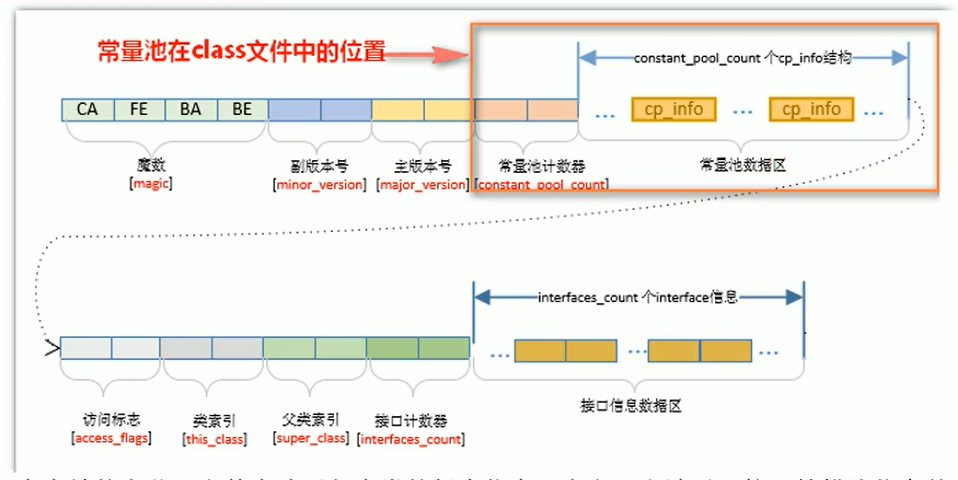
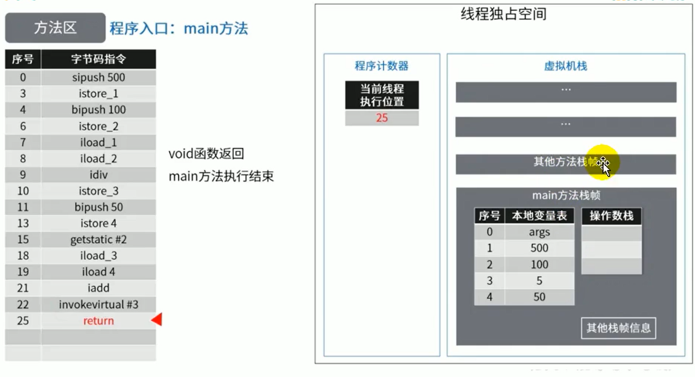
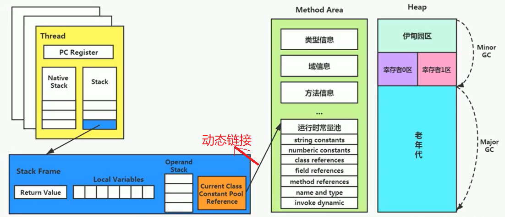

## 文档

### 文档

oracle 官网

Products

Java

Download Java now

[Online Documentation](https://docs.oracle.com/en/java/javase/17/)

Specifications

- [Language and VM](https://docs.oracle.com/javase/specs/index.html)

Java SE 17

The Java Virtual Machine Specification, Java SE 17 Edition

[HTML](https://docs.oracle.com/javase/specs/jvms/se17/html/index.html) | [PDF](https://docs.oracle.com/javase/specs/jvms/se17/jvms17.pdf)

### 2.5.4. Method Area

The Java Virtual Machine has a *method area* that is shared among all Java Virtual Machine threads. The method area is analogous to the storage area for compiled code of a conventional language or analogous to the "text" segment in an operating system process. It stores per-class structures such as the run-time constant pool, field and method data, and the code for methods and constructors, including the special methods used in class and interface initialization and in instance initialization ([§2.9](https://docs.oracle.com/javase/specs/jvms/se17/html/jvms-2.html#jvms-2.9)).

java 虚拟机有一个方法区，它是所有虚拟机线程共享的

方法区（存储编译好的class字节码指令）是相似的存储机构--传统的代码编译好的的存储区域--操作系统的进程的文本片段

它存储的是类的结构--运行时常量池，属性和方法的数据，方法和构造器的字节码，特殊的方法（<init>）用于实例和接口的初始化和实例化

The method area is created on virtual machine start-up. Although the method area is logically part of the heap, simple implementations may choose not to either garbage collect or compact it. This specification does not mandate the location of the method area or the policies used to manage compiled code. The method area may be of a fixed size or may be expanded as required by the computation and may be contracted if a larger method area becomes unnecessary. The memory for the method area does not need to be contiguous.


方法区的创建伴随着虚拟机的启动。

尽管所有的方法区在逻辑上是属于堆的一部分，但一些简单的实现可能不会选择去进行垃圾收集或者进行压缩。

《Java虚拟机规范》中么有明确限定，方法区的位置或用于管理编译代码的策略。

方法区域可以是固定大小的，或者可以根据计算的需要进行扩展，并且如果不需要更大的方法区域，则可以缩小。

方法区域的内存不需要是连续的。


A Java Virtual Machine implementation may provide the programmer or the user control over the initial size of the method area, as well as, in the case of a varying-size method area, control over the maximum and minimum method area size.

The following exceptional condition is associated with the method area:

- If memory in the method area cannot be made available to satisfy an allocation request, the Java Virtual Machine throws an `OutOfMemoryError`.

Java虚拟机实现可以为程序员或用户提供对方法区域的初始大小的控制，以及在改变大小的方法区域的情况下，对最大和最小方法区域大小的控制。

以下异常情况与方法区域相关：

如果方法区域中的内存无法用于满足分配请求，Java虚拟机将抛出OutOfMemoryError。


## 前言

这次所讲述的是运行时数据区的最后一个部分


从线程共享与否的角度来看


ThreadLocal：如何保证多个线程在并发环境下的安全性？典型应用就是数据库连接管理，以及会话管理


## 栈、堆、方法区的交互关系

栈上存储：实例对象在堆中的地址指针（局部变量）

堆中存储：实例对象，对象的类型指针指向，字符串常量池，方法区的对象类型数据，堆中存储的是数据，并不存储数据的类型，数据的类型在方法区中存储

方法区：instanceKlass对象（class元信息--数据的类型）与 运行时常量池

注意：Class对象是  instanceKlass 的镜像在堆中


- Person元信息（数据的类型）：存放在元空间，也可以说方法区
- person：存放在Java栈的局部变量表中
- new Person()：存放在Java堆中
- Person.class 在堆中--是Person元信息镜像

HotSpot并不把方法区的instanceKlass暴露给Java，而是暴露class对象给用户


### JVM中OOP-KLASS模型

在JVM中，使用了OOP-KLASS模型来表示java对象，即：

- jvm在加载class时，创建instanceKlass，表示其元数据，包括常量池、字段、方法等，存放在方法区；

  instanceKlass是jvm中的数据结构；

- 在new一个对象时，jvm创建instanceOopDesc，来表示这个对象，存放在堆区，其引用，存放在栈区；

  它用来表示对象的实例信息，看起来像个指针实际上是藏在指针里的对象；instanceOopDesc对应java中的对象实例；

- HotSpot并不把方法区的instanceKlass暴露给Java，而会另外创建对应的instanceOopDesc来表示java.lang.Class对象，并将后者称为前者的“Java镜像”，klass持有指向oop引用(_java_mirror便是该instanceKlass（方法区的）对Class对象的引用)；

- 要注意，new操作返回的instanceOopDesc类型指针指向方法区的instanceKlass，而方法区的instanceKlass指向了对应的类型的Class实例的instanceOopDesc；

- 有点绕，简单说，就是Person实例——>Person的instanceKlass——>Person的Class。

  

instanceOopDesc，只包含数据信息，它包含三部分：

1. 对象头，也叫Mark Word，主要存储对象运行时记录信息，如hashcode, GC分代年龄，锁状态标志，线程ID，时间戳等;
2. 元数据指针，即指向方法区的instanceKlass实例
3. 实例数据;
4. 数据对齐
5. 另外，如果是数组对象，还多了一个数组长度


## 方法区的理解

《Java虚拟机规范》中明确说明：“尽管所有的方法区在逻辑上是属于堆的一部分，但一些简单的实现可能不会选择去进行垃圾收集或者进行压缩。”但对于HotSpotJVM而言，方法区还有一个别名叫做Non-Heap（非堆），目的就是要和堆分开。

所以，方法区看作是一块独立于Java堆的内存空间。


方法区主要存放的是 Class 信息，而堆中主要存放的是 实例化的对象（class对象存放 java堆之中）

- 方法区（Method Area）与Java堆一样，是各个线程共享的内存区域。
- 方法区在JVM启动的时候被创建，并且它的实际的物理内存空间中和Java堆区一样都可以是不连续的。
- 方法区的大小，跟堆空间一样，可以选择固定大小或者可扩展。
- 方法区的大小决定了系统可以保存多少个类，如果系统定义了太多的类，导致方法区溢出，虚拟机同样会抛出内存溢出错误：ava.lang.OutOfMemoryError：PermGen space 或者java.lang.OutOfMemoryError:Metaspace
  - 加载大量的第三方的jar包
  - Tomcat部署的工程过多（30~50个）
  - 大量动态的生成反射类（动态代理生成的类）
- 关闭JVM就会释放这个区域的内存。


## HotSpot中方法区的演进

方法区：接口

永久代：jdk7方法区的实现

元空间：jdk8方法区的实现


在jdk7及以前，习惯上把方法区，称为永久代。jdk8开始，使用元空间取代了永久代。

- JDK 1.8后，元空间存放在堆外内存中

本质上，方法区和永久代并不等价。仅是对hotspot而言的。

《Java虚拟机规范》对如何实现方法区，不做统一要求。

例如：BEA  JRockit / IBM  J9 中不存在永久代的概念。            

>现在来看，当年使用永久代，不是好的idea。导致Java程序更容易oom（超过-XX:MaxPermsize上限）
>
>以前很容易超过XX:MaxPermsize上限，而且前期很难判断方法区的大小


而到了JDK8，终于完全废弃了永久代的概念，改用与JRockit、J9一样在本地内存中实现的元空间（Metaspace）来代替


元空间的本质和永久代类似，都是对JVM规范中方法区的实现。不过元空间与永久代最大的区别在于：**<u>元空间不在虚拟机设置的内存中，而是使用本地内存</u>**

永久代、元空间二者并不只是名字变了，内部结构也调整了（像字符串常量池，静态变量都变量位置）

根据《Java虚拟机规范》的规定，如果方法区无法满足新的内存分配需求时，将抛出OOM异常


## 设置方法区大小与OOM

方法区的大小不必是固定的，JVM可以根据应用的需要动态调整。 

### jdk7及以前

- 通过-xx:Permsize来设置永久代初始分配空间。默认值是20.75M
- -XX:MaxPermsize来设定永久代最大可分配空间。32位机器默认是64M，64位机器模式是82M
- 当JVM加载的类信息容量超过了这个值，会报异常OutofMemoryError:PermGen space。


### JDK8以后

元数据区大小可以使用参数 -XX:MetaspaceSize 和 -XX:MaxMetaspaceSize指定

默认值依赖于平台。windows下，-XX:MetaspaceSize是21m，-XX:MaxMetaspaceSize的值是-1，即没有限制。

与永久代不同，如果不指定大小，默认情况下，虚拟机会耗尽所有的可用系统内存。如果元数据区发生溢出，虚拟机一样会抛出异常OutOfMemoryError:Metaspace

-XX:MetaspaceSize：设置初始的元空间大小。对于一个64位的服务器端JVM来说，其默认的-xx:MetaspaceSize值为21MB。这就是初始的高水位线，一旦触及这个水位线，Ful1GC将会被触发并卸载没用的类（即这些类对应的类加载器不再存活）然后这个高水位线将会重置。新的高水位线的值取决于GC后释放了多少元空间。如果释放的空间不足，那么在不超过MaxMetaspaceSize时，适当提高该值。如果释放空间过多，则适当降低该值。

如果初始化的高水位线设置过低，上述高水位线调整情况会发生很多次。通过垃圾回收器的日志可以观察到FullGC多次调用。为了避免频繁地GC，建议将-XX:MetaspaceSize设置为一个相对较高的值。

```shell
jps
10148 HeapDemo1

jinfo -flag MetaspaceSize 10148
-XX:MetaspaceSize=22020096

jinfo -flag MaxMetaspaceSize 10148
-XX:MaxMetaspaceSize=18446744073709551615
```


-XX:MetaspaceSize=21m 初始默认值

-XX:MaxMetaspaceSize=-1  默认最高值没有限制或者系统上可用的内存量

21M是初始的高水位线，一旦触及这个水位线，FullGC将会被触发并卸载没用的类（即这些类对应的类加载器不再存活）然后这个水位线将会提高

高水位线设置过低，会频繁调整，多次调用FullGC

-XX:MaxMetaspaceSize 一般我们不设置

-XX:MetaspaceSize 设置为一个相对较高的值，为了频繁FullGC

 

### 为什么要使用元空间

1. 永久代空间是有上限的，而永久代大小也很难确定的，Java程序容易OOM，为减少OOM的触发，元空间使用本地内存里面，内存上限比较大的，可以避免上述问题
2. 提升Full GC的性能，原Full GC 是回收 方法区 + 老年代的，类的卸载，条件相当苛刻，分开后各自回收的区域，并行处理，提高性能


### OOM异常示例

添加参数

```
-XX:MetaspaceSize=5m -XX:MaxMetaspaceSize=5m
```

代码

```java
package com.qin.demo.methodarea;

import org.springframework.asm.ClassWriter;
import org.springframework.asm.Opcodes;
import org.springframework.cglib.proxy.Enhancer;
import org.springframework.cglib.proxy.MethodInterceptor;
import org.springframework.cglib.proxy.MethodProxy;

import java.lang.reflect.Method;

public class MethodAreaTest extends ClassLoader {

    public static void main(String[] args) {
        cglibTest1();
        cglibTest2();
    }

    public static void cglibTest2() {
        int j = 0;
        try {
            MethodAreaTest test = new MethodAreaTest();
            for (int i = 0; i < 10000; i++) {
                //创建ClassWriter对象，用于创建二进制字节码
                ClassWriter classWriter = new ClassWriter(0);
                // 版本号，类名，包名，父类，接口
                classWriter.visit(Opcodes.V17, Opcodes.ACC_PUBLIC, "classTest" + i, "com/qin/demo/methodarea", "java/lang/Object", null);
                //生成字节码
                byte[] byteArray = classWriter.toByteArray();
                test.defineClass("classTest" + i, byteArray, 0, byteArray.length);
                j++;
            }
        } finally {
            System.out.println(j);
        }
    }


    public static void cglibTest1() {
        int j = 0;
        try {
            for (int i = 0; i < 10000; i++) {
                Enhancer enhancer = new Enhancer();
                // 设置目标类
                enhancer.setSuperclass(OOMObject.class);
                // 设置拦截对象
                enhancer.setUseCache(false);
                // 这里相当于是对于代理类上所有方法的调用，都会调用CallBack，而Callback则需要实行intercept()方法进行拦截
                enhancer.setCallback(new MethodInterceptor() {
                    @Override
                    public Object intercept(Object o, Method method, Object[] objects, MethodProxy methodProxy) throws Throwable {
                        return methodProxy.invoke(o, objects);
                    }
                });
                // 生成代理类并返回一个实例
                OOMObject o = (OOMObject) enhancer.create();
                j++;
            }
        } finally {
            System.out.println(j);
        }
    }

    static class OOMObject {
    }

}

```

异常

```java
Caused by: java.lang.OutOfMemoryError: Metaspace
```


### 如何解决这些OOM

- 要解决OOM异常或heap space的异常，一般的手段是首先通过内存映像分析工具（如Ec1ipse Memory Analyzer）对dump出来的堆转储快照进行分析，重点是确认内存中的对象是否是必要的，也就是要先分清楚到底是出现了内存泄漏（Memory Leak）还是内存溢出（Memory Overflow）
  - 内存泄漏就是 有大量的引用指向某些对象，但是这些对象以后不会使用了，但是因为它们还和GC ROOT有关联，所以导致以后这些对象也不会被回收，这就是内存泄漏的问题
- 如果是内存泄漏，可进一步通过工具查看泄漏对象到GC Roots的引用链。于是就能找到泄漏对象是通过怎样的路径与GCRoots相关联并导致垃圾收集器无法自动回收它们的。掌握了泄漏对象的类型信息，以及GCRoots引用链的信息，就可以比较准确地定位出泄漏代码的位置。
- 如果不存在内存泄漏，换句话说就是内存中的对象确实都还必须存活着，那就应当检查虚拟机的堆参数（-Xmx与-Xms），与机器物理内存对比看是否还可以调大，从代码上检查是否存在某些对象生命周期过长、持有状态时间过长的情况，尝试减少程序运行期的内存消耗。


### 内存泄漏和内存溢出区别

**内存泄漏**：内存对象不用了，还存在引用

**内存溢出**：纯属内存不够，调大-Xmx与-Xms，或者修改代码减少对象生命周期


## 方法区的内部结构


《深入理解Java虚拟机》书中对方法区（Method Area）存储内容描述如下：

它用于存储已被虚拟机加载的  类型信息、域信息（属性）、方法信息、运行时常量池、即时编译器编译后的代码缓存、 等 （类的加载器的信息---记录了被谁加载了）


静态变量（1.6 之前实例也在方法区，1.7之后移动堆中，1.8 改为元空间 静态变量实例仍在堆中，简单理解 静态变量1.7之后不在方法区中了，在堆里）


类的静态变量随类的加载而加载，不需要实例对象访问

但映射的class对象也在堆中导致staticobj也存放 java堆之中

```java
public static class Test {
    static ObjectHoldler staticobj = new ObjectHoldler();
}        
```

静态变量 staticobj 在堆中

staticobj 对应的ObjectHoldler实例对象也在堆中

java映射的Test.class对象和ObjectHoldler.class也在堆中


### 类型信息

对每个加载的类型（类class、接口interface、枚举enum、注解annotation），JVM必须在方法区中存储以下类型信息：

- 这个类型的完整有效名称（全名=包名.类名）
- 这个类型直接父类的完整有效名（对于interface或是java.lang.object，都没有父类）
- 这个类型的修饰符（public，abstract，final的某个子集）
- 这个类型直接接口的一个有序列表（实现多接口所以是列表）


### 域信息（Field--属性）

JVM必须在方法区中保存类型的所有域的相关信息以及域的声明顺序。

域的相关信息包括：域名称、域类型、域修饰符（public，private，protected，static，final，volatile，transient的某个子集）


### 方法（Method）信息

JVM必须保存所有方法的以下信息，同域信息一样包括声明顺序：

- 方法名称
- 方法的返回类型（或void）
- 方法参数的数量和类型（按顺序）
- 方法的修饰符（public，private，protected，static，final，synchronized，native，abstract的一个子集）
- 方法的字节码（bytecodes  -- 方法体）、操作数栈、局部变量表及大小（abstract和native方法除外）
- 异常表（abstract和native方法除外）

>每个异常处理的开始位置、结束位置、代码处理在程序计数器中的偏移地址、被捕获的异常类的常量池索引


### non-final的类变量

静态变量和类关联在一起，随着类的加载而加载，他们成为类数据在逻辑上的一部分

类变量被类的所有实例共享，即使没有类实例时，你也可以访问它

```java
/**
 * non-final的类变量
 *
 * @author: qinjp
 * @create: 2020-07-08-16:54
 */
public class MethodAreaTest {
    public static void main(String[] args) {
        Order order = new Order();
        order.hello();
        System.out.println(order.count);
    }
}
class Order {
    public static int count = 1;
    public static final int number = 2;
    public static void hello() {
        System.out.println("hello!");
    }
}
```

如上代码所示，即使我们把order设置为null，也不会出现空指针异常


### 全局常量

全局常量就是使用 static final 进行修饰

被声明为final的类变量的处理方法则不同，每个全局常量在编译的时候就会被分配了。 

 javap -v -p Order.class > Order.txt 

```shell
Classfile /D:/workspace/demo/target/classes/com/qin/demo/methodarea/Order.class
  Last modified 2023年4月26日; size 620 bytes
  SHA-256 checksum c1a7b33a12f01d3a8513769677b668eb7d0e41104b193661d7c2141799680417
  Compiled from "Order.java"
public class com.qin.demo.methodarea.Order
  minor version: 0
  major version: 61
  flags: (0x0021) ACC_PUBLIC, ACC_SUPER
  this_class: #22                         // com/qin/demo/methodarea/Order
  super_class: #2                         // java/lang/Object
  interfaces: 0, fields: 2, methods: 3, attributes: 1
Constant pool:
   #1 = Methodref          #2.#3          // java/lang/Object."<init>":()V
   #2 = Class              #4             // java/lang/Object
   #3 = NameAndType        #5:#6          // "<init>":()V
   #4 = Utf8               java/lang/Object
   #5 = Utf8               <init>
   #6 = Utf8               ()V
   #7 = Fieldref           #8.#9          // java/lang/System.out:Ljava/io/PrintStream;
   #8 = Class              #10            // java/lang/System
   #9 = NameAndType        #11:#12        // out:Ljava/io/PrintStream;
  #10 = Utf8               java/lang/System
  #11 = Utf8               out
  #12 = Utf8               Ljava/io/PrintStream;
  #13 = String             #14            // hello!
  #14 = Utf8               hello!
  #15 = Methodref          #16.#17        // java/io/PrintStream.println:(Ljava/lang/String;)V
  #16 = Class              #18            // java/io/PrintStream
  #17 = NameAndType        #19:#20        // println:(Ljava/lang/String;)V
  #18 = Utf8               java/io/PrintStream
  #19 = Utf8               println
  #20 = Utf8               (Ljava/lang/String;)V
  #21 = Fieldref           #22.#23        // com/qin/demo/methodarea/Order.count:I
  #22 = Class              #24            // com/qin/demo/methodarea/Order
  #23 = NameAndType        #25:#26        // count:I
  #24 = Utf8               com/qin/demo/methodarea/Order
  #25 = Utf8               count
  #26 = Utf8               I
  #27 = Utf8               number
  #28 = Utf8               ConstantValue
  #29 = Integer            2
  #30 = Utf8               Code
  #31 = Utf8               LineNumberTable
  #32 = Utf8               LocalVariableTable
  #33 = Utf8               this
  #34 = Utf8               Lcom/qin/demo/methodarea/Order;
  #35 = Utf8               hello
  #36 = Utf8               <clinit>
  #37 = Utf8               SourceFile
  #38 = Utf8               Order.java
{
  ### static 修饰的，准备阶段只是 零值
  public static int count;
    descriptor: I
    flags: (0x0009) ACC_PUBLIC, ACC_STATIC
   ###  static final 修饰，准备阶段就赋好了值
  public static final int number;
    descriptor: I
    flags: (0x0019) ACC_PUBLIC, ACC_STATIC, ACC_FINAL
    ConstantValue: int 2

  public com.qin.demo.methodarea.Order();
    descriptor: ()V
    flags: (0x0001) ACC_PUBLIC
    Code:
      stack=1, locals=1, args_size=1
         0: aload_0
         1: invokespecial #1                  // Method java/lang/Object."<init>":()V
         4: return
      LineNumberTable:
        line 3: 0
      LocalVariableTable:
        Start  Length  Slot  Name   Signature
            0       5     0  this   Lcom/qin/demo/methodarea/Order;

  public static void hello();
    descriptor: ()V
    flags: (0x0009) ACC_PUBLIC, ACC_STATIC
    Code:
      stack=2, locals=0, args_size=0
         0: getstatic     #7                  // Field java/lang/System.out:Ljava/io/PrintStream;
         3: ldc           #13                 // String hello!
         5: invokevirtual #15                 // Method java/io/PrintStream.println:(Ljava/lang/String;)V
         8: return
      LineNumberTable:
        line 7: 0
        line 8: 8

  static {};
    descriptor: ()V
    flags: (0x0008) ACC_STATIC
    Code:
      stack=1, locals=0, args_size=0
         0: iconst_1
         1: putstatic     #21                 // Field count:I
         4: return
      LineNumberTable:
        line 4: 0
}
SourceFile: "Order.java"

```


### 反编译

javap -v -c -p   (-p 加上一些私有的才能看到)

```java
package com.qin.demo.methodarea;

import java.io.Serializable;

public class MethodStructureTest extends Object implements Comparable<String>, Serializable {

    public int num = 10;

    private static String str = "测试内部数据";

    public void test1() {
        int count = 20;
        System.out.println("count = " + count);
    }

    public static int test2(int param) {
        int result = 0;
        try {
            int value = 30;
            result = value / param;
        } catch (Exception e) {
            e.printStackTrace();
            throw new RuntimeException(e);
        }
        return result;
    }

    @Override
    public int compareTo(String o) {
        return 0;
    }
}

```


javap -v -p MethodStructureTest.class  > MethodStructureTest.txt 

```shell
Classfile /D:/workspace/demo/target/classes/com/qin/demo/methodarea/MethodStructureTest.class
  Last modified 2023年4月26日; size 1986 bytes
  SHA-256 checksum 3efab5cc56a9d4a06a32430ee951d22478d8b08023ebbc1b1d2c2ca6c7567d53
  Compiled from "MethodStructureTest.java"
  ### 类的类型信息
public class com.qin.demo.methodarea.MethodStructureTest extends java.lang.Object implements java.lang.Comparable<java.lang.String>, java.io.Serializable
  minor version: 0
  major version: 61
  flags: (0x0021) ACC_PUBLIC, ACC_SUPER
  this_class: #8                          // com/qin/demo/methodarea/MethodStructureTest
  super_class: #2                         // java/lang/Object
  interfaces: 2, fields: 2, methods: 6, attributes: 4
  ## 常量池
Constant pool:
   #1 = Methodref          #2.#3          // java/lang/Object."<init>":()V
   #2 = Class              #4             // java/lang/Object
   #3 = NameAndType        #5:#6          // "<init>":()V
   #4 = Utf8               java/lang/Object
   #5 = Utf8               <init>
   #6 = Utf8               ()V
   #7 = Fieldref           #8.#9          // com/qin/demo/methodarea/MethodStructureTest.num:I
   #8 = Class              #10            // com/qin/demo/methodarea/MethodStructureTest
   #9 = NameAndType        #11:#12        // num:I
  #10 = Utf8               com/qin/demo/methodarea/MethodStructureTest
  #11 = Utf8               num
  #12 = Utf8               I
  #13 = Fieldref           #14.#15        // java/lang/System.out:Ljava/io/PrintStream;
  #14 = Class              #16            // java/lang/System
  #15 = NameAndType        #17:#18        // out:Ljava/io/PrintStream;
  #16 = Utf8               java/lang/System
  #17 = Utf8               out
  #18 = Utf8               Ljava/io/PrintStream;
  #19 = InvokeDynamic      #0:#20         // #0:makeConcatWithConstants:(I)Ljava/lang/String;
  #20 = NameAndType        #21:#22        // makeConcatWithConstants:(I)Ljava/lang/String;
  #21 = Utf8               makeConcatWithConstants
  #22 = Utf8               (I)Ljava/lang/String;
  #23 = Methodref          #24.#25        // java/io/PrintStream.println:(Ljava/lang/String;)V
  #24 = Class              #26            // java/io/PrintStream
  #25 = NameAndType        #27:#28        // println:(Ljava/lang/String;)V
  #26 = Utf8               java/io/PrintStream
  #27 = Utf8               println
  #28 = Utf8               (Ljava/lang/String;)V
  #29 = Class              #30            // java/lang/Exception
  #30 = Utf8               java/lang/Exception
  #31 = Methodref          #29.#32        // java/lang/Exception.printStackTrace:()V
  #32 = NameAndType        #33:#6         // printStackTrace:()V
  #33 = Utf8               printStackTrace
  #34 = Class              #35            // java/lang/RuntimeException
  #35 = Utf8               java/lang/RuntimeException
  #36 = Methodref          #34.#37        // java/lang/RuntimeException."<init>":(Ljava/lang/Throwable;)V
  #37 = NameAndType        #5:#38         // "<init>":(Ljava/lang/Throwable;)V
  #38 = Utf8               (Ljava/lang/Throwable;)V
  #39 = Class              #40            // java/lang/String
  #40 = Utf8               java/lang/String
  #41 = Methodref          #8.#42         // com/qin/demo/methodarea/MethodStructureTest.compareTo:(Ljava/lang/String;)I
  #42 = NameAndType        #43:#44        // compareTo:(Ljava/lang/String;)I
  #43 = Utf8               compareTo
  #44 = Utf8               (Ljava/lang/String;)I
  #45 = String             #46            // 测试内部数据
  #46 = Utf8               测试内部数据
  #47 = Fieldref           #8.#48         // com/qin/demo/methodarea/MethodStructureTest.str:Ljava/lang/String;
  #48 = NameAndType        #49:#50        // str:Ljava/lang/String;
  #49 = Utf8               str
  #50 = Utf8               Ljava/lang/String;
  #51 = Class              #52            // java/lang/Comparable
  #52 = Utf8               java/lang/Comparable
  #53 = Class              #54            // java/io/Serializable
  #54 = Utf8               java/io/Serializable
  #55 = Utf8               Code
  #56 = Utf8               LineNumberTable
  #57 = Utf8               LocalVariableTable
  #58 = Utf8               this
  #59 = Utf8               Lcom/qin/demo/methodarea/MethodStructureTest;
  #60 = Utf8               test1
  #61 = Utf8               count
  #62 = Utf8               test2
  #63 = Utf8               (I)I
  #64 = Utf8               value
  #65 = Utf8               e
  #66 = Utf8               Ljava/lang/Exception;
  #67 = Utf8               param
  #68 = Utf8               result
  #69 = Utf8               StackMapTable
  #70 = Utf8               MethodParameters
  #71 = Utf8               o
  #72 = Utf8               (Ljava/lang/Object;)I
  #73 = Utf8               <clinit>
  #74 = Utf8               Signature
  #75 = Utf8               Ljava/lang/Object;Ljava/lang/Comparable<Ljava/lang/String;>;Ljava/io/Serializable;
  #76 = Utf8               SourceFile
  #77 = Utf8               MethodStructureTest.java
  #78 = Utf8               BootstrapMethods
  #79 = MethodHandle       6:#80          // REF_invokeStatic java/lang/invoke/StringConcatFactory.makeConcatWithConstants:(Ljava/lang/invoke/MethodHandles$Lookup;Ljava/lang/String;Ljava/lang/invoke/MethodType;Ljava/lang/String;[Ljava/lang/Object;)Ljava/lang/invoke/CallSite;
  #80 = Methodref          #81.#82        // java/lang/invoke/StringConcatFactory.makeConcatWithConstants:(Ljava/lang/invoke/MethodHandles$Lookup;Ljava/lang/String;Ljava/lang/invoke/MethodType;Ljava/lang/String;[Ljava/lang/Object;)Ljava/lang/invoke/CallSite;
  #81 = Class              #83            // java/lang/invoke/StringConcatFactory
  #82 = NameAndType        #21:#84        // makeConcatWithConstants:(Ljava/lang/invoke/MethodHandles$Lookup;Ljava/lang/String;Ljava/lang/invoke/MethodType;Ljava/lang/String;[Ljava/lang/Object;)Ljava/lang/invoke/CallSite;
  #83 = Utf8               java/lang/invoke/StringConcatFactory
  #84 = Utf8               (Ljava/lang/invoke/MethodHandles$Lookup;Ljava/lang/String;Ljava/lang/invoke/MethodType;Ljava/lang/String;[Ljava/lang/Object;)Ljava/lang/invoke/CallSite;
  #85 = String             #86            // count = \u0001
  #86 = Utf8               count = \u0001
  #87 = Utf8               InnerClasses
  #88 = Class              #89            // java/lang/invoke/MethodHandles$Lookup
  #89 = Utf8               java/lang/invoke/MethodHandles$Lookup
  #90 = Class              #91            // java/lang/invoke/MethodHandles
  #91 = Utf8               java/lang/invoke/MethodHandles
  #92 = Utf8               Lookup
{
  
  ## 属性  num
  public int num;
    descriptor: I
    flags: (0x0001) ACC_PUBLIC
	
  ## 属性  str	
  private static java.lang.String str;
    descriptor: Ljava/lang/String;
    flags: (0x000a) ACC_PRIVATE, ACC_STATIC
	
  ## 构造器	
  public com.qin.demo.methodarea.MethodStructureTest();
    descriptor: ()V
    flags: (0x0001) ACC_PUBLIC
    Code:
      stack=2, locals=1, args_size=1
         0: aload_0
         1: invokespecial #1                  // Method java/lang/Object."<init>":()V
         4: aload_0
         5: bipush        10
         7: putfield      #7                  // Field num:I
        10: return
      LineNumberTable:
        line 5: 0
        line 7: 4
      LocalVariableTable:
        Start  Length  Slot  Name   Signature
            0      11     0  this   Lcom/qin/demo/methodarea/MethodStructureTest;
	
  ## test1() 方法	
  public void test1();
  	## 无参方法
    descriptor: ()V
    ## PUBLIC 方法
    flags: (0x0001) ACC_PUBLIC
    ## 方法的字节码--方法体
    Code:
      ## 操作数栈的深度  局部变量表的深度  参数长度
      stack=2, locals=2, args_size=1
         0: bipush        20
         2: istore_1
         3: getstatic     #13                 // Field java/lang/System.out:Ljava/io/PrintStream;
         6: iload_1
         7: invokedynamic #19,  0             // InvokeDynamic #0:makeConcatWithConstants:(I)Ljava/lang/String;
        12: invokevirtual #23                 // Method java/io/PrintStream.println:(Ljava/lang/String;)V
        15: return
      LineNumberTable:
        line 12: 0
        line 13: 3
        line 14: 15
      LocalVariableTable:
      	## 局部变量表，首个是this
        Start  Length  Slot  Name   Signature
            0      16     0  this   Lcom/qin/demo/methodarea/MethodStructureTest;
            3      13     1 count   I
	## test2() 方法	
  public static int test2(int);
    descriptor: (I)I
    flags: (0x0009) ACC_PUBLIC, ACC_STATIC
    Code:
      stack=3, locals=3, args_size=1
         0: iconst_0
         1: istore_1
         2: bipush        30
         4: istore_2
         5: iload_2
         6: iload_0
         7: idiv
         8: istore_1
         9: goto          26
        12: astore_2
        13: aload_2
        14: invokevirtual #31                 // Method java/lang/Exception.printStackTrace:()V
        17: new           #34                 // class java/lang/RuntimeException
        20: dup
        21: aload_2
        22: invokespecial #36                 // Method java/lang/RuntimeException."<init>":(Ljava/lang/Throwable;)V
        25: athrow
        26: iload_1
        27: ireturn
      Exception table:
         from    to  target type
             2     9    12   Class java/lang/Exception
      LineNumberTable:
        line 17: 0
        line 19: 2
        line 20: 5
        line 24: 9
        line 21: 12
        line 22: 13
        line 23: 17
        line 25: 26
      LocalVariableTable:
        Start  Length  Slot  Name   Signature
            5       4     2 value   I
           13      13     2     e   Ljava/lang/Exception;
            0      28     0 param   I
            2      26     1 result   I
      StackMapTable: number_of_entries = 2
        frame_type = 255 /* full_frame */
          offset_delta = 12
          locals = [ int, int ]
          stack = [ class java/lang/Exception ]
        frame_type = 13 /* same */
    MethodParameters:
      Name                           Flags
      param

  public int compareTo(java.lang.String);
    descriptor: (Ljava/lang/String;)I
    flags: (0x0001) ACC_PUBLIC
    Code:
      stack=1, locals=2, args_size=2
         0: iconst_0
         1: ireturn
      LineNumberTable:
        line 30: 0
      LocalVariableTable:
        Start  Length  Slot  Name   Signature
            0       2     0  this   Lcom/qin/demo/methodarea/MethodStructureTest;
            0       2     1     o   Ljava/lang/String;
    MethodParameters:
      Name                           Flags
      o

  public int compareTo(java.lang.Object);
    descriptor: (Ljava/lang/Object;)I
    flags: (0x1041) ACC_PUBLIC, ACC_BRIDGE, ACC_SYNTHETIC
    Code:
      stack=2, locals=2, args_size=2
         0: aload_0
         1: aload_1
         2: checkcast     #39                 // class java/lang/String
         5: invokevirtual #41                 // Method compareTo:(Ljava/lang/String;)I
         8: ireturn
      LineNumberTable:
        line 5: 0
      LocalVariableTable:
        Start  Length  Slot  Name   Signature
            0       9     0  this   Lcom/qin/demo/methodarea/MethodStructureTest;
    MethodParameters:
      Name                           Flags
      o                              synthetic

  static {};
    descriptor: ()V
    flags: (0x0008) ACC_STATIC
    Code:
      stack=1, locals=0, args_size=0
         0: ldc           #45                 // String 测试内部数据
         2: putstatic     #47                 // Field str:Ljava/lang/String;
         5: return
      LineNumberTable:
        line 9: 0
}
Signature: #75                          // Ljava/lang/Object;Ljava/lang/Comparable<Ljava/lang/String;>;Ljava/io/Serializable;
SourceFile: "MethodStructureTest.java"
BootstrapMethods:
  0: #79 REF_invokeStatic java/lang/invoke/StringConcatFactory.makeConcatWithConstants:(Ljava/lang/invoke/MethodHandles$Lookup;Ljava/lang/String;Ljava/lang/invoke/MethodType;Ljava/lang/String;[Ljava/lang/Object;)Ljava/lang/invoke/CallSite;
    Method arguments:
      #85 count = \u0001
InnerClasses:
  public static final #92= #88 of #90;    // Lookup=class java/lang/invoke/MethodHandles$Lookup of class java/lang/invoke/MethodHandles

```


### 运行时常量池 VS 常量池

运行时常量池，就是运行时常量池


- 方法区，内部包含了运行时常量池
- 字节码文件，内部包含了常量池
- 要弄清楚方法区，需要理解清楚ClassFile，因为加载类的信息都在方法区。
- 要弄清楚方法区的运行时常量池，需要理解清楚classFile中的常量池。


### 文档

oracle 官网

Products

Java

Download Java now

[Online Documentation](https://docs.oracle.com/en/java/javase/17/)

Specifications

- [Language and VM](https://docs.oracle.com/javase/specs/index.html)

Java SE 17

The Java Virtual Machine Specification, Java SE 17 Edition

[HTML](https://docs.oracle.com/javase/specs/jvms/se17/html/index.html) | [PDF](https://docs.oracle.com/javase/specs/jvms/se17/jvms17.pdf)

[4. The `class` File Format](https://docs.oracle.com/javase/specs/jvms/se17/html/jvms-4.html)

### 4.1. The `ClassFile` Structure

A `class` file consists of a single `ClassFile` structure:

```java
ClassFile {
    u4             magic;
    u2             minor_version;
    u2             major_version;
    u2             constant_pool_count;
    cp_info        constant_pool[constant_pool_count-1];
    u2             access_flags;
    u2             this_class;
    u2             super_class;
    u2             interfaces_count;
    u2             interfaces[interfaces_count];
    u2             fields_count;
    field_info     fields[fields_count];
    u2             methods_count;
    method_info    methods[methods_count];
    u2             attributes_count;
    attribute_info attributes[attributes_count];
}    
```


### 常量池



一个有效的字节码文件中除了包含类的版本信息、字段、方法以及接口等描述符信息外，还包含一项信息就是常量池表（Constant Pool Table），包括**各种字面量和对类型、域和方法的符号引用**

像字符串，Object，方法，属性，这些都对应有**符号引用**


#### 常量池中的数据类型--符号引用

| Constant Type               | **Value** | 描述                             |
| --------------------------- | --------- | -------------------------------- |
| CONSTANT_Class              | 7         | 对一个类或接口的符号引用         |
| CONSTANT_Fieldref           | 9         | 对一个字段的符号引用             |
| CONSTANT_Methodref          | 10        | 对一个类中声明的方法的符号引用   |
| CONSTANT_InterfaceMethodref | 11        | 对一个接口中声明的方法的符号引用 |
| CONSTANT_NameAndType        | 12        | 对一个字段或方法的部分符号引用   |
| CONSTANT_Utf8               | 1         | UTF-8编码的Unicode字符串         |
| CONSTANT_String             | 8         | String类型字面值                 |
| CONSTANT_Integer            | 3         | int类型字面值                    |
| CONSTANT_Float              | 4         | float类型字面值                  |
| CONSTANT_Long               | 5         | long类型字面值                   |
| CONSTANT_Double             | 6         | double类型字面值                 |
| CONSTANT_MethodHandle       | 15        |                                  |
| CONSTANT_MethodType         | 16        |                                  |
| CONSTANT_InvokeDynamic      | 18        |                                  |


#### 为什么需要常量池

一个java源文件中的类、接口，编译后产生一个字节码文件。而Java中的字节码需要数据支持，通常这种数据会很大以至于不能直接存到字节码里，换另一种方式，可以存到常量池，这个字节码包含了指向常量池的引用。**在动态链接的时候会用到运行时常量池**，之前有介绍。

**动态链接的时候，将符号引用变成直接引用**

比如：如下的代码：

```java
public class SimpleClass {
    public void sayHello() {
        System.out.println("hello");
    }
}
```


虽然上述代码只有 106 字节（平时写的 .java 文件），但是里面却使用了String、System、PrintStream及Object等结构。这里的代码量其实很少了，如果代码多的话，引用的结构将会更多，这里就需要用到常量池了。


#### 常量池中有什么

几种在常量池内存储的数据类型包括：

- 数量值
- 字符串值
- 类引用
- 字段引用
- 方法引用

例如下面这段代码

```java
public class MethodAreaTest2 {
    public static void main(String args[]) {
        Object obj = new Object();
    }
}
```

将会被翻译成如下字节码

```bash
new #2  // Class java/lang/Object 
dup
invokespecial #3 //Method java/lang/Object "<init>"( ) V 
```


#### 小结

常量池、可以看做是一张表，虚拟机指令根据这张常量表找到要执行的类名、方法名、参数类型、字面量等类型


### 运行时常量池

运行时常量池（Runtime Constant Pool）是方法区的一部分。

常量池表（Constant Pool Table）是Class文件的一部分，用于存放**编译期生成的各种字面量与符号引用，这部分内容将在类加载后存放到方法区的运行时常量池中**。

运行时常量池，在加载类和接口到虚拟机后，就会创建对应的运行时常量池。

**JVM为每个已加载的类型（类或接口）都维护一个常量池**。池中的数据项像数组项一样，是通过索引访问的。

每个类的常量池被加载之后都放到自己专属的一个运行时常量池区域。

就是一个 常量池  对应 一个运行时常量池

出处： [https://docs.oracle.com/javase/specs/jvms/se18/html/jvms-5.html](http://jump.bdimg.com/safecheck/index?url=rN3wPs8te/owrmQ6pfU7rgLEdCXM7MrVOAxN+2XMdbyeIT5mK/MjvyV6qcWbNmYkhxGS2LJg9/0tTCrQWIgw6vzmPpUuQ3XzBDWD/R9jwOZnS7T4K0ZfyDIxbNueECBuCYMOzjV07EwDF7OOTR2n8sPJqWwtwx9ivUmQghjh8D/0IzFKt0BNKppX7FfU3f/Q95Oz3HGEnLaGpIu7/4nRdrhKMc321bUo)

oracle 官方文档 第一句话
5.1. The Run-Time Constant Pool
The Java Virtual Machine maintains a run-time constant pool for each class and interface (§2.5.5).


运行时常量池中包含多种不同的常量，包括编译期就已经明确的数值字面量，也包括到运行期解析后才能够获得的方法或者字段引用。此时不再是常量池中的符号地址了，这里换为真实地址。

运行时常量池，相对于Class文件常量池的另一重要特征是：具备动态性。

运行时常量池类似于传统编程语言中的符号表（symboltable），但是它所包含的数据却比符号表要更加丰富一些。

当创建类或接口的运行时常量池时，如果构造运行时常量池所需的内存空间超过了方法区所能提供的最大值，则JVM会抛outofMemoryError异常。


## 方法区使用举例

如下代码

```java
public class MethodAreaDemo {
    public static void main(String args[]) {
        int x = 500;
        int y = 100;
        int a = x / y;
        int b = 50;
        System.out.println(a+b);
    }
}
```

javap -v -p -c MethodAreaDemo.class > MethodAreaDemo.txt

```
Classfile /D:/workspace/demo/target/classes/com/qin/demo/methodarea/MethodAreaDemo.class
  Last modified 2023年4月27日; size 682 bytes
  SHA-256 checksum c3d74e2dbf02b88ab9ac517f9a06232f4a6fb5eb435d556b66b54189767221b0
  Compiled from "MethodAreaDemo.java"
public class com.qin.demo.methodarea.MethodAreaDemo
  minor version: 0
  major version: 61
  flags: (0x0021) ACC_PUBLIC, ACC_SUPER
  this_class: #19                         // com/qin/demo/methodarea/MethodAreaDemo
  super_class: #2                         // java/lang/Object
  interfaces: 0, fields: 0, methods: 2, attributes: 1
Constant pool:
   #1 = Methodref          #2.#3          // java/lang/Object."<init>":()V
   #2 = Class              #4             // java/lang/Object
   #3 = NameAndType        #5:#6          // "<init>":()V
   #4 = Utf8               java/lang/Object
   #5 = Utf8               <init>
   #6 = Utf8               ()V
   #7 = Fieldref           #8.#9          // java/lang/System.out:Ljava/io/PrintStream;
   #8 = Class              #10            // java/lang/System
   #9 = NameAndType        #11:#12        // out:Ljava/io/PrintStream;
  #10 = Utf8               java/lang/System
  #11 = Utf8               out
  #12 = Utf8               Ljava/io/PrintStream;
  #13 = Methodref          #14.#15        // java/io/PrintStream.println:(I)V
  #14 = Class              #16            // java/io/PrintStream
  #15 = NameAndType        #17:#18        // println:(I)V
  #16 = Utf8               java/io/PrintStream
  #17 = Utf8               println
  #18 = Utf8               (I)V
  #19 = Class              #20            // com/qin/demo/methodarea/MethodAreaDemo
  #20 = Utf8               com/qin/demo/methodarea/MethodAreaDemo
  #21 = Utf8               Code
  #22 = Utf8               LineNumberTable
  #23 = Utf8               LocalVariableTable
  #24 = Utf8               this
  #25 = Utf8               Lcom/qin/demo/methodarea/MethodAreaDemo;
  #26 = Utf8               main
  #27 = Utf8               ([Ljava/lang/String;)V
  #28 = Utf8               args
  #29 = Utf8               [Ljava/lang/String;
  #30 = Utf8               x
  #31 = Utf8               I
  #32 = Utf8               y
  #33 = Utf8               a
  #34 = Utf8               b
  #35 = Utf8               MethodParameters
  #36 = Utf8               SourceFile
  #37 = Utf8               MethodAreaDemo.java
{
  public com.qin.demo.methodarea.MethodAreaDemo();
    descriptor: ()V
    flags: (0x0001) ACC_PUBLIC
    Code:
      stack=1, locals=1, args_size=1
         0: aload_0
         1: invokespecial #1                  // Method java/lang/Object."<init>":()V
         4: return
      LineNumberTable:
        line 3: 0
      LocalVariableTable:
        Start  Length  Slot  Name   Signature
            0       5     0  this   Lcom/qin/demo/methodarea/MethodAreaDemo;

  public static void main(java.lang.String[]);
    descriptor: ([Ljava/lang/String;)V
    flags: (0x0009) ACC_PUBLIC, ACC_STATIC
    Code:
      stack=3, locals=5, args_size=1
         0: sipush        500
         3: istore_1
         4: bipush        100
         6: istore_2
         7: iload_1
         8: iload_2
         9: idiv
        10: istore_3
        11: bipush        50
        13: istore        4
        15: getstatic     #7                  // Field java/lang/System.out:Ljava/io/PrintStream;
        18: iload_3
        19: iload         4
        21: iadd
        22: invokevirtual #13                 // Method java/io/PrintStream.println:(I)V
        25: return
      LineNumberTable:
        line 5: 0
        line 6: 4
        line 7: 7
        line 8: 11
        line 9: 15
        line 10: 25
      LocalVariableTable:
        Start  Length  Slot  Name   Signature
            0      26     0  args   [Ljava/lang/String;
            4      22     1     x   I
            7      19     2     y   I
           11      15     3     a   I
           15      11     4     b   I
    MethodParameters:
      Name                           Flags
      args
}
SourceFile: "MethodAreaDemo.java"

```

字节码执行过程展示


首先现将操作数500放入到操作数栈中


然后存储到局部变量表中


然后重复一次，把100放入到操作数栈中，然后把100放入局部变量表中

最后再将变量表中的500 和 100 取出，放到操作数栈中，等待进行操作


将500 和 100 进行一个除法运算，在把结果 5 入栈  


然后 将 5 存储本地变量表 3

然后 将 50 压入操作数栈中


然后 将 50 存储本地变量表 4


  输出流  #2，需要调用运行时常量池的常量，最后发现是  输出流 


最后调用invokevirtual（虚方法调用），然后返回


返回



main栈帧，结束抛弃

程序计数器始终计算的都是当前代码运行的位置，目的是为了方便记录 方法调用后能够正常返回，或者是进行了CPU切换后，也能回来到原来的代码进行执行。


## 方法区的演进细节

首先明确：只有Hotspot才有永久代。

BEA  JRockit、IBM J9等来说，是不存在永久代的概念的。

原则上如何实现方法区属于虚拟机实现细节，不受《Java虚拟机规范》管束，并不要求统一


Hotspot中方法区的变化：

| JDK1.6及以前 | 有永久代，静态变量存储在永久代上                             |
| ------------ | ------------------------------------------------------------ |
| JDK1.7       | 有永久代，但已经逐步 “去永久代”，字符串常量池，静态变量移除，保存在堆中 |
| JDK1.8       | 无永久代，类型信息，字段，方法，常量保存在本地内存的元空间，但字符串常量池、静态变量仍然在堆中。 |

JDK6的时候


JDK7的时候


JDK8的时候，元空间大小只受物理内存影响


### 为什么永久代要被元空间替代？

详见：[JEP 122: Remove the Permanent Generation](https://openjdk.org/jeps/122)


JRockit是和HotSpot融合后的结果，因为JRockit没有永久代，所以他们不需要配置永久代


随着Java8的到来，HotSpot VM中再也见不到永久代了。但是这并不意味着类的元数据信息也消失了。这些数据被移到了一个与堆不相连的本地内存区域，这个区域叫做元空间（Metaspace）。


由于类的元数据分配在本地内存中，元空间的最大可分配空间就是系统可用内存空间，这项改动是很有必要的，原因有：

- 为永久代设置空间大小是很难确定的。

在某些场景下，如果动态加载类过多，容易产生Perm区的oom。比如某个实际Web工
程中，因为功能点比较多，在运行过程中，要不断动态加载很多类，经常出现致命错误。

“Exception in thread‘dubbo client x.x connector'java.lang.OutOfMemoryError:PermGen space”

而元空间和永久代之间最大的区别在于：元空间并不在虚拟机中，而是使用本地内存。
因此，默认情况下，元空间的大小仅受本地内存限制。


- 对永久代进行调优是很困难的。
  - 主要是为了降低Full GC

方法区的垃圾收集主要回收两部分内容：常量池中废弃的常量和不在使用的类

有些人认为方法区（如HotSpot虚拟机中的元空间或者永久代）是没有垃圾收集行为的，其实不然。《Java虚拟机规范》对方法区的约束是非常宽松的，提到过可以不要求虚拟机在方法区中实现垃圾收集。事实上也确实有未实现或未能完整实现方法区类型卸载的收集器存在（如JDK11时期的ZGC收集器就不支持类卸载）。
一般来说这个区域的回收效果比较难令人满意，尤其是类型的卸载，条件相当苛刻。但是这部分区域的回收有时又确实是必要的。以前sun公司的Bug列表中，曾出现过的若干个严重的Bug就是由于低版本的HotSpot虚拟机对此区域未完全回收而导致内存泄漏


### StringTable为什么要调整位置

jdk7中将StringTable放到了堆空间中。因为永久代的回收效率很低，在Full GC的时候才会触发。而Full GC是老年代的空间不足、永久代不足时才会触发。

这就导致stringTable回收效率不高。而我们开发中会有大量的字符串被创建，回收效率低，导致永久代内存不足。放到堆里，能及时回收内存。


### 静态变量存放在那里？

静态引用对应的对象实体始终都存在堆空间

可以使用 jhsdb.ext，需要在jdk9的时候才引入的

```java
package com.qin.demo.methodarea;

public class StaticObjTest {

    static class Test {
        static ObjectHoldler staticobj = new ObjectHoldler();
        ObjectHoldler instanceobj = new ObjectHoldler();

        void foo () {
            ObjectHoldler localobject = new ObjectHoldler();
            System.out.println("done");
        }
    }

    private static class ObjectHoldler {
    }

    public static void main(String[] args) {
        Test test = new StaticObjTest.Test();
        test.foo();
    }

}
```

1. JDK6 及以下 staticObj 随着Test的类型信息存放在方法区
2. JDK7 开始 staticobj 随着Test.class 对象存放在Java堆，
3. staticobj 对应的ObjectHoldler实例对象也在堆中
4. instanceobj随着Test的对象实例存放在Java堆，
5. localobject则是存放在foo（）方法栈帧的局部变量表中。


> 1、0x00007f32c7800000(Eden区的起始地址) ---- 0x00007f32c7b50000(Eden区的终止地址)
>
> 2、可以发现三个变量都在这个范围内
>
> 3、所以可以得到上面结论

测试发现：三个对象的数据在内存中的地址都落在Eden区范围内，

所以结论：只要是对象实例必然会在Java堆中分配。

6. 接着，找到了一个引用该staticobj对象的地方，是在一个java.lang.Class的实例里，并且给出了这个实例的地址，通过Inspector查看该对象实例，可以清楚看到这确实是一个java.lang.Class类型的对象实例，里面有一个名为staticobj的实例字段：


从《Java虚拟机规范》所定义的概念模型来看，所有Class相关的信息都应该存放在方法区之中，但方法区该如何实现，《Java虚拟机规范》并未做出规定，这就成了一件允许不同虚拟机自己灵活把握的事情。JDK7及其以后版本的HotSpot虚拟机选择把静态变量与类型在Java语言一端的映射class对象存放在一起，存储于Java堆之中，从我们的实验中也明确验证了这一点


**结论：**

类的静态变量随类的加载而加载，不需要实例对象访问

但 JDK7 开始映射的class对象在堆中导致 staticobj  这个静态属性也存放 java堆之中

```java
public static class Test {
    static ObjectHoldler staticobj = new ObjectHoldler();
}        
```

JDK7 开始静态变量 staticobj 静态属性 在堆中

静态属性 staticobj 对应的 ObjectHoldler实例对象也在堆中

映射Test.class对象和ObjectHoldler.class对象也在堆中


## 方法区的垃圾回收

有些人认为方法区（如Hotspot虚拟机中的元空间或者永久代）是没有垃圾收集行为的，其实不然。《Java虚拟机规范》对方法区的约束是非常宽松的，提到过可以不要求虚拟机在方法区中实现垃圾收集。事实上也确实有未实现或未能完整实现方法区类型卸载的收集器存在（如JDK11时期的ZGC收集器就不支持类卸载）。


一般来说这个区域的回收效果比较难令人满意，尤其是类型的卸载，条件相当苛刻。但是这部分区域的回收有时又确实是必要的。以前sun公司的Bug列表中，曾出现过的若干个严重的Bug就是由于低版本的HotSpot虚拟机对此区域未完全回收而导致内存泄漏。（费力不讨好）


方法区的垃圾收集主要回收两部分内容：运行时常量池中废弃的常量和不再使用的class的类型信息。


先来说说方法区内常量池之中主要存放的两大类常量：字面量和符号引用。字面量比较接近Java语言层次的常量概念，如文本字符串、被声明为final的常量值等。而符号引用则属于编译原理方面的概念，包括下面三类常量：

- 类和接口的全限定名
- 字段的名称和描述符
- 方法的名称和描述符

HotSpot虚拟机对常量池的回收策略是很明确的，只要常量池中的常量没有被任何地方引用，就可以被回收。

回收废弃常量与回收Java堆中的对象非常类似。（关于常量的回收比较简单，重点是类的回收）

判定一个常量是否“废弃”还是相对简单，而要判定一个类型是否属于“不再被使用的类”的条件就比较苛刻了。需要同时满足下面三个条件：

- 该类所有的实例都已经被回收，也就是Java堆中不存在该类及其任何派生子类的实例。

- 加载该类的类加载器已经被回收，这个条件除非是经过精心设计的可替换类加载器的场景，如osGi、JSP的重加载等，否则通常是很难达成的。

- 该类对应的java.lang.Class对象没有在任何地方被引用，无法在任何地方通过反射访问该类的方法。

  

Java虚拟机被允许对满足上述三个条件的无用类进行回收，这里说的仅仅是“被允许”，而并不是和对象一样，没有引用了就必然会回收。关于是否要对类型进行回收，HotSpot虚拟机提供了-Xnoclassgc参数进行控制，还可以使用-verbose:class 以及 -XX：+TraceClass-Loading、-XX：+TraceClassUnLoading查看类加载和卸载信息

  

在大量使用反射、动态代理、CGLib等字节码框架，动态生成JSP以及oSGi这类频繁自定义类加载器的场景中，通常都需要Java虚拟机具备类型卸载的能力，以保证不会对方法区造成过大的内存压力。


## 方法区类卸载

当类同时满足三个条件时，这个类的生命周期就结束了，会被卸载。

1. 该类的所有实例都已经被回收，也就是java堆中不存在该类的任何实例。
2. 加载该类的ClassLoader已经被回收。
3. 该类对应的java.lang.Class对象没有任何地方被引用，无法在任何地方通过反射访问该类。

注意：

1.由java虚拟机自带的三种类加载加载的类在虚拟机的整个生命周期中是不会被卸载的，由用户自定义的类加载器所加载的类才可以被卸载

2.通过虚拟机参数，可以查看类的加载与卸载过程

-verbose:class 跟踪类的加载和卸载

-XX:+TraceClassLoading 跟踪类的加载

-XX:+TraceClassUnloading 跟踪类的卸载

3.通过System.gc()来促进回收


系统会自动判断有没有这个类需要被卸载


类被卸载了，对应的--字符串常量（堆中），类型信息（方法区中），运行常量池（方法区中）都要被回收


## 总结




### 常见面试题

百度
三面：说一下JVM内存模型吧，有哪些区？分别干什么的？

蚂蚁金服：
Java8的内存分代改进
JVM内存分哪几个区，每个区的作用是什么？
一面：JVM内存分布/内存结构？栈和堆的区别？堆的结构？为什么两个survivor区？
二面：Eden和survior的比例分配

小米：
jvm内存分区，为什么要有新生代和老年代

字节跳动：
二面：Java的内存分区
二面：讲讲vm运行时数据库区
什么时候对象会进入老年代？

京东：
JVM的内存结构，Eden和Survivor比例。
JVM内存为什么要分成新生代，老年代，持久代。新生代中为什么要分为Eden和survivor。

天猫：
一面：Jvm内存模型以及分区，需要详细到每个区放什么。
一面：JVM的内存模型，Java8做了什么改

拼多多：
JVM内存分哪几个区，每个区的作用是什么？

美团：
java内存分配
jvm的永久代中会发生垃圾回收吗？
一面：jvm内存分区，为什么要有新生代和老年代？