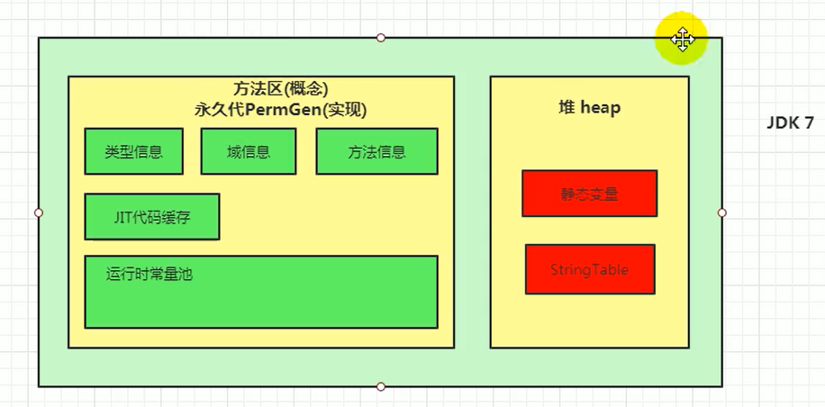

### 栈、堆、方法区的交互关系

栈上存储：实例对象在堆中的地址指针（局部变量）

堆中存储：实例对象，对象的类型指针指向，字符串常量池，方法区的对象类型数据，堆中存储的是数据，并不存储数据的类型，数据的类型在方法区中存储

方法区：instanceKlass对象（class元信息--数据的类型）与 运行时常量池

注意：Class对象是  instanceKlass 的镜像在堆中


- Person元信息（数据的类型）：存放在元空间，也可以说方法区
- person：存放在Java栈的局部变量表中
- new Person()：存放在Java堆中
- Person.class 在堆中--是Person元信息镜像

HotSpot并不把方法区的instanceKlass暴露给Java，而是暴露class对象给用户


### 虚拟机栈

保存方法的局部变量（8种基本数据类型，对象引用地址：堆中的地址指针）、部分结果，并参与方法的调用和返回。

存储单位：栈帧

### 栈帧的内部结构

#### 局部变量表（Local Variables）

一个数字数组：内部存储数字的数组

存储 `方法参数` 和 `方法体内的局部变量`

##### Slot

局部变量表，最基本的存储单元是Slot（变量槽）

32位以内的类型只占用一个slot（包括returnAddress类型）

64位的类型（1ong和double）占用两个slot

实例对象引用**this**将会存放在index为0的slot处

#### 操作数栈（operand Stack）（或表达式栈）

一个数组保存中间变量的，不过只有出栈和入栈

#### 动态链接（DynamicLinking）（或指向运行时常量池的方法引用）

存储当前方法对应方法区class方法的引用

编译期确定符号引用，动态链接转换为调用方法的直接引用

#### 方法返回地址（Return Address）（或方法正常退出或者异常退出的定义）

存储下一条指令的地址（下一条PC寄存器的值）

#### 一些附加信息


### 堆

对象实例以及数组基本都分配在堆上

#### 堆内存细分


新生区+养老区+元空间

Young Generation Space ：Eden + Survivor0 + Survivor1

Old  Generation Space 

Meta Space


### 方法区

存储：类型信息、域信息（属性）、方法信息、运行时常量池、即时编译器编译后的代码缓存、 等 （类的加载器的信息---记录了被谁加载了）


1.6 之前 静态变量也在方法区（1.6 之前实例也在方法区，1.7之后移动堆中，1.8 改为元空间 静态变量实例仍在堆中，简单理解 静态变量1.7之后不在方法区中了，在堆里）


类的静态变量随类的加载而加载，不需要实例对象访问

但 JDK7 开始映射的class对象在堆中导致 staticobj  这个静态属性也存放 java堆之中

```java
public static class Test {
    static ObjectHoldler staticobj = new ObjectHoldler();
}        
```

JDK7 开始 静态变量 staticobj 在堆中

静态属性 staticobj 对应的 ObjectHoldler实例对象也在堆中

java映射的Test.class对象和ObjectHoldler.class对象也在堆中


JDK6的时候


JDK7的时候



JDK8的时候，元空间大小只受物理内存影响


### JVM中OOP-KLASS模型

在JVM中，使用了OOP-KLASS模型来表示java对象，即：

- jvm在加载class时，创建instanceKlass，表示其元数据，包括常量池、字段、方法等，存放在方法区；

  instanceKlass是jvm中的数据结构；

- 在new一个对象时，jvm创建instanceOopDesc，来表示这个对象，存放在堆区，其引用，存放在栈区；

  它用来表示对象的实例信息，看起来像个指针实际上是藏在指针里的对象；instanceOopDesc对应java中的对象实例；

- HotSpot并不把方法区的instanceKlass暴露给Java，而会另外创建对应的instanceOopDesc来表示java.lang.Class对象，并将后者称为前者的“Java镜像”，klass持有指向oop引用(_java_mirror便是该instanceKlass（方法区的）对Class对象的引用)；

- 要注意，new操作返回的instanceOopDesc类型指针指向方法区的instanceKlass，而方法区的instanceKlass指向了对应的类型的Class实例的instanceOopDesc；

- 有点绕，简单说，就是Person实例——>Person的instanceKlass——>Person的Class。

  

instanceOopDesc，只包含数据信息，它包含三部分：

1. 对象头，也叫Mark Word，主要存储对象运行时记录信息，如hashcode, GC分代年龄，锁状态标志，线程ID，时间戳等;
2. 元数据指针，即指向方法区的instanceKlass实例
3. 实例数据;
4. 数据对齐
5. 另外，如果是数组对象，还多了一个数组长度


### 实例对象

mark 对象头  + class 指针对象   + 数据 + 对齐字节

#### Java对象数据结构

概括起来分为对象头、对象体（属性数据）和对齐字节

**对象头：**Mark Word 

**Klass Word** ：Class信息的指针--指向方法区的Class的实例

**数组长度**：只有是数组对象才有

**对象体：**对象的属性

**对齐字节：**必须是8字节的整数倍

**内存堆中**：实例对象只有数据部分，要结合方法区来得到属性的含义


```java
@Data
public class Student {

    private String name;

    private int age;

    private int score;
    
    public Student() {
    }

    public Student(String name, int age, int score) {
        this.name = name;
        this.age = age;
        this.score = score;
    }
    
}
```


内存堆中：student 只有数据部分，结合方法区来得到属性

结构：

mark 对象头  + class 指针对象   + 12  + 100 + 字符串name的引用地址 

例如：

student.name ：通过class指针指向方法区的 name 发现 offset（偏移量） 是 20

那么堆中指针往后20个字节表示name的值

student.age ：通过class指针指向方法区的 age 发现 offset（偏移量） 是 12

那么堆中指针再往后12个字节表示age的值

student.score ：通过class指针指向方法区的 score 发现 offset（偏移量） 是 16

那么堆中指针再往后16个字节表示score的值


