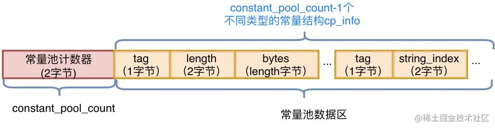
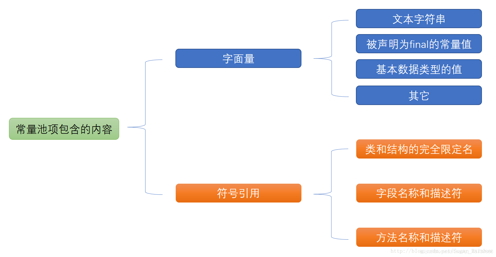
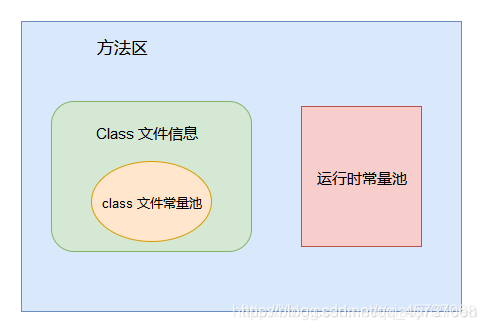

### Class常量池

字节码结构里面的一部分，紧接着主版本号之后的字节为常量池入口

存放包括**各种字面量和对类型、域和方法的符号引用**


常量池中存放了文字字符串， 常量值， 

当前类的类名， 字段名， 方法名， 各个字段和方法的描述符， 

对当前类的字段和方法的引用信息， 

当前类中对其他类的引用信息等等。


常量池中几乎包含类中的所有信息的描述， class文件中的很多其他部分都是对常量池中的数据项的引用，

比如后面要讲到的this_class, super_class, field_info, attribute_info等都对常量池中的数据项引用


另外字节码指令中也存在对常量池的引用， 

这个对常量池的引用当做字节码指令的一个操作数。  

此外， 常量池中各个项也会相互引用


class文件中的项constant_pool_count的值为1, 说明**每个类都只有一个常量池**

常量池中的数据也是一项一项的， 没有间隙的依次排放。

常量池中各个数据项通过索引来访问， 有点类似与数组， 只不过常量池中的第一项的索引为1, 而不为0, 

如果class文件中的其他地方引用了索引为0的常量池项， 就说明它不引用任何常量池项。

class文件中的每一种数据项都有自己的类型， 相同的道理，常量池中的每一种数据项也有自己的类型。 


常量池整体分为两个部分：常量池计数器以及常量池数据区




### 常量池中的数据项的类型

| Constant Type               | **Value** | 描述                             |
| --------------------------- | --------- | -------------------------------- |
| CONSTANT_Class              | 7         | 对一个类或接口的符号引用         |
| CONSTANT_Fieldref           | 9         | 对一个字段的符号引用             |
| CONSTANT_Methodref          | 10        | 对一个类中声明的方法的符号引用   |
| CONSTANT_InterfaceMethodref | 11        | 对一个接口中声明的方法的符号引用 |
| CONSTANT_NameAndType        | 12        | 对一个字段或方法的部分符号引用   |
| CONSTANT_Utf8               | 1         | UTF-8编码的Unicode字符串         |
| CONSTANT_String             | 8         | String类型字面值                 |
| CONSTANT_Integer            | 3         | int类型字面值                    |
| CONSTANT_Float              | 4         | float类型字面值                  |
| CONSTANT_Long               | 5         | long类型字面值                   |
| CONSTANT_Double             | 6         | double类型字面值                 |
| CONSTANT_MethodHandle       | 15        |                                  |
| CONSTANT_MethodType         | 16        |                                  |
| CONSTANT_InvokeDynamic      | 18        |                                  |


每个数据项叫做一个XXX_info项， 比如， 一个常量池中一个CONSTANT_Utf8类型的项， 就是一个CONSTANT_Utf8_info 。

除此之外， 每个info项中都有一个标志值（tag）

CONSTANT_Utf8_info中的tag值为1， 而CONSTANT_Fieldref_info中的tag值为9


常量池里不同常量对应数据结构

```java
CONSTANT_Class_info {
    u1 tag;
    u2 name_index;//name_index需要是常量池中有效下标
}

CONSTANT_Utf8_info {
    u1 tag;
    u2 length; //bytes的长度，即字节数
    u1 bytes[length];
}

CONSTANT_Fieldref_info {
    u1 tag;
    u2 class_index;
    u2 name_and_type_index;
}

CONSTANT_Methodref_info {
    u1 tag;
    u2 class_index;
    u2 name_and_type_index;
}

CONSTANT_InterfaceMethodref_info {
    u1 tag;
    u2 class_index;
    u2 name_and_type_index;
}


CONSTANT_String_info {
    u1 tag;
    u2 string_index;
}

CONSTANT_Integer_info {
    u1 tag;
    u4 bytes;
}

CONSTANT_Float_info {
    u1 tag;
    u4 bytes;
}

CONSTANT_Long_info {
    u1 tag;
    u4 high_bytes;
    u4 low_bytes;
}

CONSTANT_Double_info {
    u1 tag;
    u4 high_bytes;
    u4 low_bytes;
}

CONSTANT_NameAndType_info {
    u1 tag;
    u2 name_index;
    u2 descriptor_index;
}

CONSTANT_MethodHandle_info {
    u1 tag;
    u1 reference_kind;
    u2 reference_index;
}

CONSTANT_MethodType_info {
    u1 tag;
    u2 descriptor_index;
}

CONSTANT_InvokeDynamic_info {
    u1 tag;
    u2 bootstrap_method_attr_index;
    u2 name_and_type_index;
}
```


> PS： 为什么constant_pool_count的值是常量池的数量+1，从1开始到n-1结束？不从0开始的原因是什么？
>
> 这个问题在这里提一下，因为常量池中很多常量需要引用其他常量，而有可能存在常量并不需要任何有效引用，所以常量池空置了下标0的位置作为备用


### 运行时常量池

运行时常量池是方法区的一部分（java 8 元空间  Metaspace）

简单理解就是当Class文件被Java虚拟机加载进来后，存放在方法区的 **各种字面量** (Literal)和 **符号引用**

当Class文件被加载到内存后，Java虚拟机会**将Class文件结构（常量池）里的内容转移到运行时常量池里(运行时常量池也是每个类都有一个)**





### 方法区的Class文件信息，Class常量池和运行时常量池的三者关系

Class文件信息：

简称结构：

魔数 + 次版本号 + 主版本号 +常量池 +访问标志+当前类索引+父类索引+接口索引+字段表+方法表 + 附加属性


Class常量池:

Class文件信息里面的常量池 

里面存放了文字字符串， 常量值， 

当前类的类名， 字段名， 方法名， 各个字段和方法的描述符， 

对当前类的字段和方法的引用信息， 

当前类中对其他类的引用信息等等


运行时常量池：（在方法区）

虚拟机加载到内存的**Class文件常量池里的内容**




### 字符串常量池

全局字符串池，英文也叫`String Pool`

本质就是Hashtable

key 存储的是 字符串和长度的 hashcode值

value 就是字符串对象的引用

java 8 之后就防到了堆中了


### 存放位置

字符串常量池在堆中, 运行时常量池在方法区


