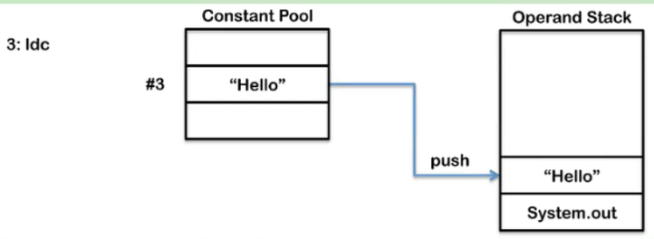
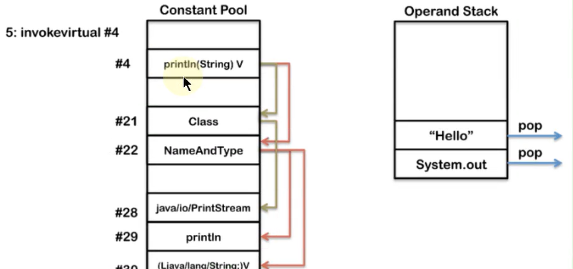
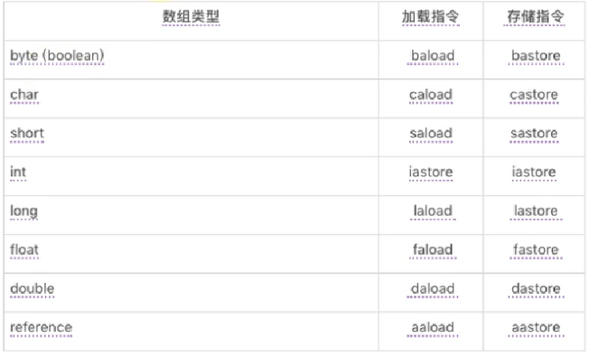
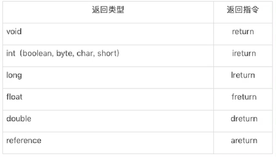
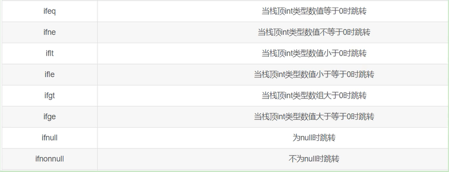
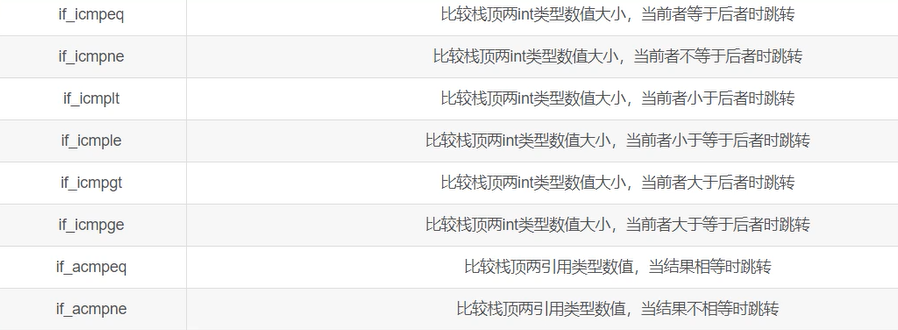
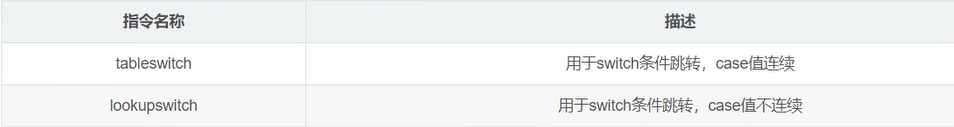
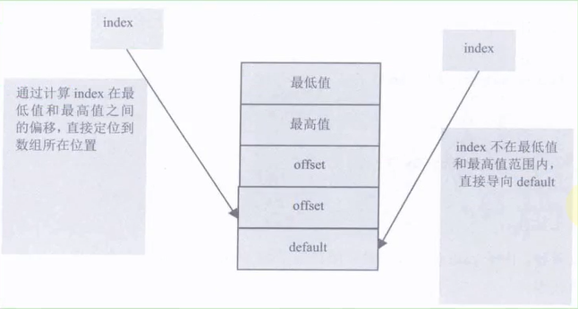
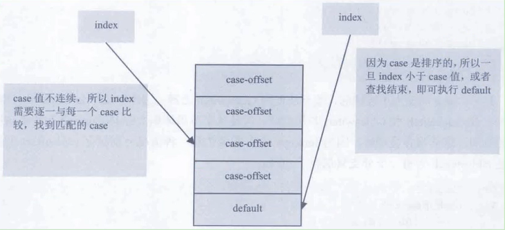
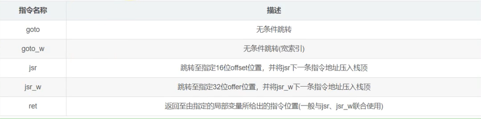

### Java-底层建筑-JVM-第19篇-字节码指令集与解析举例

#### 概述

- Java字节码对于虚拟机，就好像汇编语言对于计算机，属于基本执行指令。
- Java虚拟机的指令由 **一个字节长度的**、代表着某种特定操作含义的数字（称为操作码，Opcode）以及跟随其后的零至多个代表此操作所需参数（称为操作数，Operands）而构成。由于Java虚拟机采用面向操作数栈而不是面向寄存器的结构，所以大多数的指令都不包含操作数，只有一个操作码
- 由于限制了Java虚拟机操作码的长度为一个字节（8位，2的8次方=256 即0~255），这意味着指令集的操作码总数不可能超过256条
- 官方文档： https://docs.oracle.com/javase/specs/jvms/se8/html/jvms-6.html 
- 熟悉虚拟机的指令对于动态字节码生成、反编译 Class 文件、 Class 文件修补都有着非常重要的价值。因此，阅读字节码作为了解 Java 虚拟机的基础技能，需要熟练掌握常见指令 

##### 执行模型

- 如果不考虑异常处理的话，那么 Java 虚拟机的解释器可以使用下面这个伪代码当做最基本的执行模型来理解

```java
do {
    // 上一天操作码流程结束，循环一个 +1 ，寻找下一个地址
    自动计算PC寄存器的值加1;
    // 取出操作码
    根据PC寄存器的指示位置，从字节码流中取出操作码;
    // 查看操作码是否有操作数
    if(字节码存在操作数) 从字节码流中取出操作数;
    // 执行操作
    执行操作码所定义的操作;
    // 下一个操作码 code_length > 0
}while(字节码长度>0)
```

##### 字节码与数据类型

- 在 Java 虚拟机的指令集中，大多数的指令都包含了其操作所对应的数据类型信息。
- 例如，iload 指令用于从局部变量表中加载 int 类型的数据到操作数栈中，而 fload 指令加载的则是 float 类型的数据
- 对于大部分与数据类型相关的字节码指令，**它们的操作码助记符中都有特殊的字符来表明专门为哪种数据类型服务：**
  - i 代表对 int 类型的数据操作
  - l 代表 long
  - s 代表 short
  - b 代表 byte
  - c 代表 char
  - f 代表 float
  - d 代表 double
- 也有一些指令的助记符中**没有明确地指明操作类型的字母**，如 arraylength 指令，它没有代表数据类型的特殊字符，但操作数永远只能是一个数组类型的对象
- 还有另一些指令，如无条件跳转指令 goto 则是与**数据类型无关的**
- 大部分的指令都没有支持整数类型 byte、char 和 short，甚至没有任何指令支持 boolean 类型。编译器会在编译器或运行期将 byte 和short 类型的数据带符号扩展(Sign-Extend)为相应的 int 类型数据，将 boolean 和 char 类型数据零位扩展(Zero-Extend)为相应的 int 类型数据。与之类似，在处理 boolean、byte、short 和 char 类型的数组时，也会转换为使用对应的 init 类型的字节码指令来处理。因此，大多数对于 boolean、byte、short 和 char 类型数据的操作，实际上都是使用相应的 int 类型作为运算类型

##### 指令分类

- 由于完全介绍和学习这些指令需要花费大量时间，为了让能够更快地熟悉和了解这些基本指令，这里将 JVM 中的字节码指令集按用途大致分成9类：
  - 加载与存储指令
  - 算术指令
  - 类型转换指令
  - 对象的创建与访问指令
  - 方法调用与返回指令
  - 操作数栈管理指令
  - 比较控制指令
  - 异常处理指令
  - 同步控制指令

- 在做值相关操作时：
  - 一个指令，可以从局部变量表、常量池、堆中对象、方法调用、系统调用等中取得数据，这些数据(可能是值，可能是对象的引用)被压入操作数栈
  - 一个指令，也可以从操作数栈中取出一到多个值(pop 多次)，完成赋值、加减乘除、方法传参、系统调用等操作

#### 加载与存储指令

- 作用：加载和存储指令用于将数据从栈帧的局部变量表和操作数栈之间来回传递
- 常用指令
- - 「局部变量压栈指令」将一个局部变量加载到操作数栈：`xload、xload_`(`其中 x 为 i、l、f、d、a，n 为 0 到 3`)；`xaload、xaload`(`其 x 为 i、l、f、d、a、b、c、s，n 为 0 到 3`)
  - 「常量入栈指令」将一个常量加载到操作数栈：`bipush、sipush、ldc、ldc_w、ldc2_w、aconst_null、iconst_m1、iconst_、iconst_、fconst_、dconst_`
  - 「出栈装入局部变量表指令」将一个数值从操作数栈存储到局部变量表：`xstore、xstore_`(`其中 x 为 i、l、f、d、a，n 为 0 到 3`); `xastore`(`其中 x 为 i、l、f、d、a、b、c、s`)
  - 扩充局部变量表的访问索引的指令：`wide`
- 上面所列举的指令助记符中，有一部分是以尖括号结尾的(例如`iload_`)。这些指令助记符实际上代表了一组指令(例如`iload_`代表了`iload_0、iload_1、iload_2和iload_3`这几个指令)。这几组指令都是某个带有一个操作数的通用指令(例如 `iload`)的特殊形式，**对于这若干组特殊指令来说，它们表面上没有操作数，不需要进行取操作数的动作，但操作数都隐含在指令中**
  - iload_0  ：将局部变量表  0  位置的整型数据 压入操作数栈中
  - iload  4  ：将局部变量表  4  位置的整型数据 压入操作数栈中
- 除此之外，它们的语义与原生的通用指令完全一致(例如 `iload_0`的语义与操作数为0时的`iload`指令语义完全一致)。在尖括号之间的字母指定了指令隐含操作数的数据类型，``代表非负的整数，``代表是 int 类型数据，``代表 long 类型，``代表 float 类型，``代表 double 类型
- 操作 byte、char、short 和 boolean 类型数据时，经常用 int 类型的指令来表示

##### 再谈操作数栈和局部变量表

**操作数栈(Operand Stacks)**

- 我们知道，Java 字节码是 Java 虚拟机所使用的指令集。因此，它与 Java 虚拟机基于栈的计算模型是密不可分的

- 在解释执行过程中，每当为 Java 方法分配栈帧时，Java 虚拟机往往需要开辟一块额外的空间作为操作数栈，来存放计算的操作数以及返回结果

- 具体来说便是：执行每一条指令之前，Java 虚拟机要求该指令的操作数已被压入操作数栈中。在执行指令时，Java 虚拟机会将该指令所需的操作数弹出，并且将指令的结果重新压入栈中


- 以加法指令 iadd 为例。假设在执行该指令之前，栈顶的两个元素分别为 int 值 1 和 int 值 2，那么 iadd 指令将弹出这两个 int，并将求得的和 int 值为 3 压入栈中 


- 由于 iadd 指令只消耗栈顶的两个元素，因此，对于离栈顶距离为 2 的元素，即图中的问号，iadd 指令并不关心它是否存在，更加不会对其进行修改 

**局部变量表(Local Variables)**

- Java 方法栈帧的另外一个重要组成部分则是局部变量区，**字节码程序可以将计算的结果缓存在局部变量区之中**

- 实际上，Java 虚拟机将局部变量区**当成一个数组**，依次存放 this 指针(仅非静态方法)，所传入的参数，以及字节码中的局部变量。

- 和操作数栈一样，long 类型以及 double 类型的值将占据两个单元，其余类型仅占据一个单元


- **举例：**

```java
public void foo(long l, float f) {
    {
        int i = 0;
    }
    {
        String s = "Hello, World"
    }
}
```

- **对应得图示：**


- 在栈帧中，与性能调优关系最为密切的部分就是局部变量表。局部变量表中的变量也是重要的垃圾回收根节点，只要被局部变量表中直接或间接引用的对象都不会被回收
- 在方法执行时，虚拟机使用局部变量表完成方法的传递
- i 和 s 代表的是槽的复用


##### 局部变量压栈指令

> iload 从局部变量中装载int类型值
>
> lload 从局部变量中装载long类型值
>
> fload 从局部变量中装载float类型值
>
> dload 从局部变量中装载double类型值
>
> aload 从局部变量中装载引用类型值（refernce）
>
> iload_0 从局部变量0中装载int类型值
>
> iload_1 从局部变量1中装载int类型值
>
> iload_2 从局部变量2中装载int类型值
>
> iload_3 从局部变量3中装载int类型值
>
> lload_0 从局部变量0中装载long类型值
>
> lload_1 从局部变量1中装载long类型值
>
> lload_2 从局部变量2中装载long类型值
>
> lload_3 从局部变量3中装载long类型值
>
> fload_0 从局部变量0中装载float类型值
>
> fload_1 从局部变量1中装载float类型值
>
> fload_2 从局部变量2中装载float类型值
>
> fload_3 从局部变量3中装载float类型值
>
> dload_0 从局部变量0中装载double类型值
>
> dload_1 从局部变量1中装载double类型值
>
> dload_2 从局部变量2中装载double类型值
>
> dload_3 从局部变量3中装载double类型值
>
> aload_0 从局部变量0中装载引用类型值
>
> aload_1 从局部变量1中装载引用类型值
>
> aload_2 从局部变量2中装载引用类型值
>
> aload_3 从局部变量3中装载引用类型值
>
> iaload 从数组中装载int类型值
>
> laload 从数组中装载long类型值
>
> faload 从数组中装载float类型值
>
> daload 从数组中装载double类型值
>
> aaload 从数组中装载引用类型值
>
> baload 从数组中装载byte类型或boolean类型值
>
> caload 从数组中装载char类型值
>
> saload 从数组中装载short类型值

- 局部变量压栈指令将给定的局部变量表中的数据压入操作数栈
- 这类指令大体可以分为：
  - `xload_`(`x`为`i、l、f、d、a，n为 0 到 3`)
  - `xload`(`x`为`i、l、f、d、a`)
- 说明：在这里，`x`的取值表示数据类型
- 指令`xload_n`表示将第`n`个局部变量压入操作数栈，比如`iload_1、fload_0、aload_0`等指令。其中`aload_n`表示将一个对象引用压栈
- 指令`xload`通过指定参数的形式，把局部变量压入操作数栈，当使用这个命令时，表示局部变量的数量可能超过了4个，比如指令`iload、fload`等

```java
public class LoadAndStoreTest {

    // 局部变量压栈指令
    public void load(int num, Object obj, long count, boolean flag, short[] arr) {
        System.out.println(num);
        System.out.println(obj);
        System.out.println(count);
        System.out.println(flag);
        System.out.println(arr);
    }
}
```


##### 常量入栈指令

> aconst_null 将null对象引用压入栈
>
> iconst_m1 将int类型常量-1压入栈
>
> iconst_0 将int类型常量0压入栈
>
> iconst_1 将int类型常量1压入栈
>
> iconst_2 将int类型常量2压入栈
>
> iconst_3 将int类型常量3压入栈
>
> iconst_4 将int类型常量4压入栈
>
> iconst_5 将int类型常量5压入栈
>
> lconst_0 将long类型常量0压入栈
>
> lconst_1 将long类型常量1压入栈
>
> fconst_0 将float类型常量0压入栈
>
> fconst_1 将float类型常量1压入栈
>
> dconst_0 将double类型常量0压入栈
>
> dconst_1 将double类型常量1压入栈
>
> bipush 将一个8位带符号整数压入栈
>
> sipush 将16位带符号整数压入栈
>
> ldc 把常量池中的项压入栈
>
> ldc_w 把常量池中的项压入栈（使用宽索引）
>
> ldc2_w 把常量池中long类型或者double类型的项压入栈（使用宽索引）

- 常量入栈指令的功能是将常数压入操作数栈，根据数据类型和入栈内容的不同，又可以分为 const 系列、push 系列和 ldc 指令
- **指令 const 系列：**用于对特定的常量入栈，入栈的常量隐含在指令本身里。指令有：`iconst_(i从-1到5)、lconst_(l从0到1)、fconst_(f从0到2)、dconst_(d从0到1)、aconst_null`
- **比如：**
  - iconst_m1将-1压入操作数栈
  - iconst_x(x为0到5)将 x 压入栈
  - lconst_0、lconst_1 分别将长整数0和1压入栈
  - fconst_0、fconst_1、fconst_2 分别将浮点数0、1、2压入栈
  - dconst_0 和 dconst_1 分别将 double 型0和1压入栈
  - aconst_null 将 null 压入操作数栈
- 从指令的命名上不难找出规律，指令助记符的第一个字符总是喜欢表示数据类型，i 表示整数，l 表示长整型，f 表示浮点数，d 表示双精度浮点，习惯上用 a 表示对象引用。如果指令隐含操作的参数，会以下划线形式给出
- **指令 push 系列：**主要包括 bipush 和 sipush，它们的区别在于接受数据类型的不同，bipush 接收8位整数作为参数，sipush 接收16位整数，它们都将参数压入栈
- **指令 ldc 系列：**如果以上指令都不能满足需求，那么可以使用万能的 ldc 指令，它可以接收一个8位的参数，该参数指向常量池中的 int、float 或者 String 的索引，将指定的内容压入堆栈
- 类似的还有 ldc_w，它接收两个8位参数，能支持的索引范围大于 ldc
  - 常量池中的常量特别多，一个 8位参数不够用，自动升级为 ldc_w
  - ldc #300 ，300 一个8位不够装，升级 ldc_w #300
- 压入的元素是 long 或者 double 类型的，则使用 ldc2_w 指令，使用方式都是类似的
- 总结如下：


iconst  -1,0,1,2,3,4,5  只有这几个 

对应 iconst_m1, iconst_0, iconst_1, iconst_2, iconst_3,iconst_4,iconst_5

没有 iconst  6 ，超过6 就是 bipush 6  超过 127 就是 sipush

idc 可以是任何值

int i = 3   iconst_3

int j = 6   bipush 6

int k  =   32767  sipush  32767   

int l = 32768   idc 32768  

int 类型赋值


long i 1    lconst_1

long i 2   ldc2_w  #29 <2> (超过 2 只能是 ldc2_w   #29 常量池中的 2)


float b1 = 2    fconst_2

float b2 = 3   ldc #31 <3.0>(超过 3 只能是 ldc  #31 常量池中的3.0) 


double c1 = 1    dconst_1  

double c2 = 2     ldc2_w #32 <2.0> (超过 2 只能是 ldc2_w  #32 常量池中的2.0)   


Date d = null      aconst_null


##### 出栈装入局部变量表

> istore 将int类型值存入局部变量
>
> lstore 将long类型值存入局部变量
>
> fstore 将float类型值存入局部变量
>
> dstore 将double类型值存入局部变量
>
> astore 将将引用类型或returnAddress类型值存入局部变量
>
> istore_0 将int类型值存入局部变量0
>
> istore_1 将int类型值存入局部变量1
>
> istore_2 将int类型值存入局部变量2
>
> istore_3 将int类型值存入局部变量3
>
> lstore_0 将long类型值存入局部变量0
>
> lstore_1 将long类型值存入局部变量1
>
> lstore_2 将long类型值存入局部变量2
>
> lstore_3 将long类型值存入局部变量3
>
> fstore_0 将float类型值存入局部变量0
>
> fstore_1 将float类型值存入局部变量1
>
> fstore_2 将float类型值存入局部变量2
>
> fstore_3 将float类型值存入局部变量3
>
> dstore_0 将double类型值存入局部变量0
>
> dstore_1 将double类型值存入局部变量1
>
> dstore_2 将double类型值存入局部变量2
>
> dstore_3 将double类型值存入局部变量3
>
> astore_0 将引用类型或returnAddress类型值存入局部变量0
>
> astore_1 将引用类型或returnAddress类型值存入局部变量1
>
> astore_2 将引用类型或returnAddress类型值存入局部变量2
>
> astore_3 将引用类型或returnAddress类型值存入局部变量3
>
> iastore 将int类型值存入数组中
>
> lastore 将long类型值存入数组中
>
> fastore 将float类型值存入数组中
>
> dastore 将double类型值存入数组中
>
> aastore 将引用类型值存入数组中
>
> bastore 将byte类型或者boolean类型值存入数组中
>
> castore 将char类型值存入数组中
>
> sastore 将short类型值存入数组中
>
> wide指令
>
> wide 使用附加字节扩展局部变量索引

- 出栈装入局部变量表指令用于将操作数栈中栈顶元素弹出后，装入局部变量表的指定位置，用于给局部变量赋值
- 这类指令主要以 store 的形式存在，比如 xstore (x 为 i、l、f、d、a)、xstore_n(x 为 i、l、f、d、a，n 为0至3)和 pasture(x 为 i、l、f、d、a、b、c、s)
  - 其中，指令 istore_n 将从操作数栈中弹出一个整数，并把它赋值给局部变量 n
  - 指令 xstore 由于没有隐含参数信息，故需要提供一个 byte 类型的参数类指定目标局部变量表的位置
  - xastore 则专门针对数组操作，以 iastore 为例，它用于给一个 int 数组的给定索引赋值。在 iastore 执行前，操作数栈顶需要以此准备3个元素：值、索引、数组引用，iastore 会弹出这3个值，并将值赋给数组中指定索引的位置
- 一般说来，类似像 store 这样的命令需要带一个参数，用来指明将弹出的元素放在局部变量表的第几个位置。但是，为了尽可能压缩指令大小，使用专门的 istore_1 指令表示将弹出的元素放置在局部变量表第1个位置。类似的还有 istore_0、istore_2、istore_3，它们分别表示从操作数栈顶弹出一个元素，存放在局部变量表第0、2、3个位置
- 由于局部变量表前几个位置总是非常常用，因此这种做法虽然增加了指令数量，但是可以大大压缩生成的字节码的体积。如果局部变量表很大，需要存储的槽位大于3，那么可以使用 istore 指令，外加一个参数，用来表示需要存放的槽位位置


```java
// 演示代码
public class LoadAndStoreTest {

    // 局部变量压栈指令
    public void load(int num, Object obj, long count, boolean flag, short[] arr) {
        System.out.println(num);
        System.out.println(obj);
        System.out.println(count);
        System.out.println(flag);
        System.out.println(arr);
    }

    // 常量入栈指令
    public void pushConstLdc() {
        int a = 5;
        int b = 6;
        int c = 127;
        int d = 128;
        int e = 1234567;
    }

    public void constLdc() {
        long a1 = 1;
        long a2 = 2;
        float b1 = 2;
        float b2 = 3;
        double c1 = 1;
        double c2 = 2;
        Date d = null;
    }

    // 出栈装入局部变量表指令
    public void store(int k, double d) {
        int m = k + 2;
        int l = 12;
        String str = "atguigu";
        float f = 10.0F;
        d = 10;
    }

    public void foo(long l, float f) {
        {
            int i = 0;
        }
        {
            String s = "hello world";
        }
    }
}

```


#### 算术运算符指令以及举例

> ## 整数运算
>
> iadd 执行int类型的加法
>
> ladd 执行long类型的加法
>
> isub 执行int类型的减法
>
> lsub 执行long类型的减法
>
> imul 执行int类型的乘法
>
> lmul 执行long类型的乘法
>
> idiv 执行int类型的除法
>
> ldiv 执行long类型的除法
>
> irem 计算int类型除法的余数
>
> lrem 计算long类型除法的余数
>
> ineg 对一个int类型值进行取反操作
>
> lneg 对一个long类型值进行取反操作
>
> iinc 把一个常量值加到一个int类型的局部变量上
>
> ## 逻辑运算
>
> ### 移位操作
>
> ishl 执行int类型的向左移位操作
>
> lshl 执行long类型的向左移位操作
>
> ishr 执行int类型的向右移位操作
>
> lshr 执行long类型的向右移位操作
>
> iushr 执行int类型的向右逻辑移位操作
>
> lushr 执行long类型的向右逻辑移位操作
>
> ### 按位布尔运算
>
> iand 对int类型值进行“逻辑与”操作
>
> land 对long类型值进行“逻辑与”操作
>
> ior 对int类型值进行“逻辑或”操作
>
> lor 对long类型值进行“逻辑或”操作
>
> ixor 对int类型值进行“逻辑异或”操作
>
> lxor 对long类型值进行“逻辑异或”操作
>
> ### 浮点运算
>
> fadd 执行float类型的加法
>
> dadd 执行double类型的加法
>
> fsub 执行float类型的减法
>
> dsub 执行double类型的减法
>
> fmul 执行float类型的乘法
>
> dmul 执行double类型的乘法
>
> fdiv 执行float类型的除法
>
> ddiv 执行double类型的除法
>
> frem 计算float类型除法的余数
>
> drem 计算double类型除法的余数
>
> fneg 将一个float类型的数值取反
>
> dneg 将一个double类型的数值取反

- **作用**：算术指令大都用于对两个操作数栈上的值进行某种特定的运算（也有一个的例如取反），**并把结果重新压入操作数栈**

- **分类**：大体上算术指令可以分为两种：对 **整型数据** 进行运算的指令与对 **浮点类型数据** 进行运算的指令

- **byte、short、char和boolean类型说明**

  - 在每一大类中，都有针对Java虚拟机具体数据类型的专用算术指令。但是没有直接支持byte、short、char和boolean类型的算术指令，对于这些数据的运算，都是用int类型的指令来处理。此外，在处理boolean、byte、short和char类型的数组的时候，也会转换成对应的int类型的字节码指令进行处理。

  

- **运算时的溢出**

  - 数据运算可能会导致溢出，例如两个很大的正整数相加，结果可能只是一个负数。
  - 其实Java虚拟机规范并没有明确规定整型数据溢出的结果，仅仅规定了在处理整型数据的时候，只有除法指令以及求余指令中出现除数为0的情况下，会导致虚拟机抛出 ArithmetciException 异常

- **运算模式**

  - 向最接近数舍入模式：JVM 要求在进行浮点数计算时，所有的运算结果都必须舍入到适当的精度，非精确结果必须舍入为可被表示的最接近的精确值，如果有两种可表示的形式与该值一样接近，将优先选择最低有效位为零的。
  - 向零舍入模式：将浮点数转换为整数时，采用该模式，该模式将在目标数值类型中选择一个最接近但是不大于原值的数字作为最精确的舍入结果。

- **NaN的使用**

  - 当一个操作产生溢出时，将会使用有符号的无穷大表示  （ jInfinity ）
  - 如果某个操作结果没有明确的数学定义的话，将会使用 NaN 值来表示。而且所有使用 NaN 值作为操作数的算术操作，结果都会返回 NaN 。

##### 所有的运算符指令

- 所有的运算符指令包括
- 加法指令：iadd、ladd、fadd、dadd
- 减法指令：isub、lsub、fsub、dsub
- 乘法指令：imul、lmul、fmul、dmul
- 除法指令：idiv、ldiv、fdiv、ddiv
- 求余指令：irem、lrem、frem、drem(remainder：余数)
- 取反指令：ineg、lneg、fneg、dneg(negation：取反)
- 自增指令：iinc
- 位运算指令，又可分为：
- - 位移指令：ishl、ishr、iushr、lshl、lshr、lushr
  - 按位或指令：ior、lor
  - 按位与指令：iand、land
  - 按位异或指令：ixor、lxor
- 比较指令：dcmpg、dcmlp、fcmpg、fcmpl、lcmp


##### 关于++操作的理解

```java
public class IAdd {
    public void m1() {
        int i = 10;
        i++;
    }

    public void m2() {
        int i = 10;
        ++i;
    }

    public void m3() {
        int i = 10;
        int a = i++;

        int j = 20;
        int b = ++j;
    }

    public void m4() {
        int i = 10;
        i = i++;
        System.out.println(i);
    }
}

```

- 对于不参与运算的情况下，i++ 和 ++i 的字节码操作是一样的


- 参与运算的情况下


- i = 1++ 的情况下


##### 比较指令的说明

- 比较指令的作用是比较栈顶两个元素的大小，并将比较结果入栈
- 比较指令有：dcmpg、dcmpl、fcmpg、fcmpl、lcmp
- - 与前面讲解的指令类似，首字符 d 表示 double 类型，f 表示 float，l 表示 long
- 对于 double 和 float 类型的数字，由于 NaN 的存在，各有两个版本的比较指令，以 float 为例，有 fcmpg 和 fcmpl 两个指令，它们的区别在于在数字比较时，若遇到 NaN 值，处理结果不同
- 指令 dcmpl 和 dcmpg 也是类似的，根据其命名可以推测其含义，在此不再赘述
- 指令 lcmp 针对 long 型整数，由于 long 型整数没有 NaN 值，故无需准备两套指令

  

举例：
- 指令 fcmpg 和 fcmpl 都从栈中弹出两个操作数，并将它们做比较，设栈顶的元素为 v2， 栈顶顺位第2位元素为 v1，若 v1 = v2，则压入0；若 v1 > v2 则压入1；若 v1 < v2 则压入-1
- 两个指令的不同之处在于，如果遇到 NaN 值，fcmpg 会压入1，而 fcmpl 会压入-1
- 数值类型的数据才可以谈大小，boolean、引用数据类型不能比较大小

**为什么没有int 比较指令呢？因为下面有 比较条件跳转指令 转们比较int值控制流程的**

**数值类型的数据才可以谈大小**

**boolean、引用数据类型不能比较大小**


#### 类型转换指令

> ## 宽化类型转换
>
> i2l 把int类型的数据转化为long类型
>
> i2f 把int类型的数据转化为float类型
>
> i2d 把int类型的数据转化为double类型
>
> l2f 把long类型的数据转化为float类型
>
> l2d 把long类型的数据转化为double类型
>
> f2d 把float类型的数据转化为double类型
>
> ## 窄化类型转换
>
> i2b 把int类型的数据转化为byte类型
>
> i2c 把int类型的数据转化为char类型
>
> i2s 把int类型的数据转化为short类型
>
> l2i 把long类型的数据转化为int类型
>
> f2i 把float类型的数据转化为int类型
>
> f2l 把float类型的数据转化为long类型
>
> d2i 把double类型的数据转化为int类型
>
> d2l 把double类型的数据转化为long类型
>
> d2f 把double类型的数据转化为float类型

- **类型转换指令说明**
  - 类型转换指令可以将两种不同的数值类型进行相互转换
  - 这些转换操作一般用于实现用户代码中的 **显式类型转换操作，** 或者用来处理**字节码指令集中数据类型相关指令**无法与**数据类型**一一对应的问题

##### 宽化类型转换(Widening Numeric Conversions)

- **转换规则**：小的可以往大的转，大的不能往小的转报错
- Java 虚拟机直接支持以下数值的宽化类型转换(Widening Numeric Conversion，小范围类型向大范围类型的安全转换)。也就是说，并不需要指令执行，包括：
  - 从 int 类型到 long、float 或者 double 类型，对应的指令为：i2l、i2f、i2d
  - 从 long 类型到 float、double 类型。对应的指令为：l2f、l2d
  - 从 flaot 类型到 double 类型。对应的指令为：f2d
  - 简化为：int --> long --> float --> double


- **精度损失问题**
  - 宽化类型转换是不会因为超过目标类型最大值而丢失信息的，例如，从 int 转换到 long，或者从 int 转换到 double，都不会丢失任何信息，转换前后的值是精确相等的 
  - 从 int、long 类型数值转换到 float，或者 long 类型树脂转换到 double 时，将可能发生丢失精度——可能丢失掉几个最低有效位上的值，转换后的浮点数值是根据 IEEE754 最接近舍入模式所得到的正确整数数值。尽管宽化类型转换实际上是可能发生精度丢失的，但是这种转换永远不会导致 Java 虚拟机抛出运行时异常 
    - int 4字节（32位），long 8字节，float 4字节，double  8字节
  - **从 byte、char 和 short 类型到 int 类型的宽化类型转换实际上是不存在的**，对于 byte 类型转换为 int，虚拟机并没有做实质性的转化处理，知识简单地通过操作数栈交换了两个数据。而 byte 转为 long 时，使用的是 i2l，可以看到在内部 byte 在这里已经等同于 int 类型处理，类似的还有 short 类型，这种处理方式有两个特点 ：
    - 一方面可以减少实际的数据类型，如果为 short 和 byte 都准备一套指令，那么指令的数量就会大增，而**虚拟机目前的设计上，只愿意使用一个字节表示指令，因此指令总数不能超过256个，为了节省指令资源，将 short 和 byte 当作 int 处理也是情理之中** 
    - 另一方面，由于局部变量表中的槽位固定为32位，无论是 byte 或者 short 存入局部变量表，都会占用32位空间。从这个角度来说，也没有必要特意区分这几种数据类型 


##### 窄化类型转换(Narrowing Numeric Conversion)

- **转换规则：大转小需要强制转换**

  - Java 虚拟机也直接支持以下窄化类型转换：
    - 从 int 类型至 byte、short 或者 char 类型。对应的指令有：i2b、i2c、i2s
    - 从 long 类型到 int 类型。对应的指令有：l2i
    - 从 float 类型到 int 或者 long 类型。对应的指令有：f2i、f2l
    - 从 double 类型到 int、long 或者 float 类型。对应的指令有：d2i、d2l、d2f

- 精度损失问题

  - 窄化类型转换可能会导致转换结果具备不同的正负号、不同的数量级，因此，转换过程很可能会导致数值丢失精度

  - 尽管数据类型窄化转换可能会发生上限溢出、下限溢出和精度丢失等情况，但是 Java 虚拟机规范中明确规定数值类型的窄化转换指令永远不可能导致虚拟机抛出运行时异常

  - 例如：byte 范围 -128-127 ，int 类型的 200转 只能是 -56

  - ```java
    public static void intf(){
        int i =  -129;//计算机负数使用补码，存储 -129的补码是65407
        byte b = (byte) i;
        System.out.println(b);
    }
    输出：127
    ```

    

- 补充说明

  - 当将一个浮点值窄化转换为整数类型T（T限于int类型或者long类型之一）的时候，将遵循以下转换原则

    - 如果浮点为NaN，那么转换结果就是int 或者long类型的0
    - 如果浮点值不是无穷大的话，浮点值使用 IEEE 754 的向零舍入模式取整，获得整数值v，如果v在目标类型T（int 或者 long）的表示范围之内，那转换的结果就是v。否则，将根据v的符号，转换T所能表示的最大或者最小正数。

  - 当将一个double类型窄化转换为float类型的时候，将遵循以下转换规则，通过向最接近数舍入模式舍入一个可以使用float类型表示的数字。最后结果根据下面这3条规则判断。

    - 如果转换结果的绝对值太小而无法使用float表示，将返回float类型的正负0

      - 太小的double 转 float 只能是 0

    - 如果转换结果的绝对值太大而无法使用float表示，将返回float类型的正负无穷大对于double类型的NaN值将按规定转换为float类型的NaN值
    
      - 太大的double 转 float 只能是 NaN
      
      
  
- 注意：

  - 没有 long 转 byte 这样最大转最小的指令，实际内部会做两次转换，先转int ,再转byte
  - 例如：long l = 10L ,   byte b = (byte) l ; // 生成两条转换指令  l2i   i2b
  - 类似；float转byte 或者 double 转byte  一样 


#### 对象的创建和访问指令

> ## 对象操作指令
>
> new 创建一个新对象
>
> getfield 从对象中获取字段
>
> putfield 设置对象中字段的值
>
> getstatic 从类中获取静态字段
>
> putstatic 设置类中静态字段的值
>
> checkcast 确定对象为所给定的类型。后跟目标类，判断栈顶元素是否为目标类 / 接口的实例。如果不是便抛出异常
>
> instanceof 判断对象是否为给定的类型。后跟目标类，判断栈顶元素是否为目标类 / 接口的实例。是则压入 1，否则压入 0
>
>
> ## 数组操作指令
>
> newarray 分配数据成员类型为基本上数据类型的新数组
>
> anewarray 分配数据成员类型为引用类型的新数组
>
> arraylength 获取数组长度
>
> multianewarray 分配新的多维数组

Java是面向对象的程序设计语言，虚拟机平台从字节码层面就对面向对象做了深层次的支持。有一系列指令专门用于对象操作，可进一步细分为创建指令、字段访问指令、数组操作指令、类型检查指令

##### 创建指令

- 虽然类实例和数组都是对象。但是Java虚拟机对类实例和数组的创建与操作使用了不同的字节码指令

- **类创建实例的指令**
  - new
  
  - 它接收一个操作数，为指向常量池的索引，表示要创建的类型，执行完成之后，将对象的引用压入栈
  
  - 与dup 联合使用
  
  - ```java
    public void newInstance(){
        Object obj = new Object();
    }
    
    0 new #2 <java/lang/Object>   // 在堆中new一个对象，将引用地址压入操作数栈
    3 dup   // 在栈中将引用地址再复制一个到栈中，因为下面调用构造器的时候，需要消耗一个操作数栈，所以多复制一个到操作数栈中
    4 invokespecial #1 <java/lang/Object.<init> : ()V> // 调用构造器方法
    7 astore_1 // 在局部变量 1 存储
    8 return
    ```
  
- **创建数组的指令**
  
  - newarray、anewarray、multiannewarray
  - newarray：创建基本数据类型数组
  - anewarray：创建引用数据类型数组
  - multiannewarray：创建多维数组
  
- 上述指令可以用于创建对象或者数组，由于对象和数组再Java中的广泛使用，这些指令的使用频率也非常高。

- ```java
  public void newArray(){
      int[] intArray = new int[10];
      Object[] objtArray = new Object[10];
      int[][] mulArry = new int[10][10];
      String[][] strArr = new String[10][];//第二个参数是null,所以变成了创建一唯数组
      String[][] mulArr = new String[10][10];//这才是创建二唯数组
  }
  
   0 bipush 10
   2 newarray 10 (int)
   4 astore_1
   5 bipush 10
   7 anewarray #2 <java/lang/Object>
  10 astore_2
  11 bipush 10
  13 bipush 10
  15 multianewarray #24 <[[I> dim 2
  19 astore_3
  20 bipush 10
  22 anewarray #26 <[Ljava/lang/String;>  //String[][] strArr = new String[10][];
  25 astore 4
  27 bipush 10
  29 bipush 10
  31 multianewarray #28 <[[Ljava/lang/String;> dim 2 //String[][] mulArr = new String[10][10];
  35 astore 5
  37 return
  
  ```

  

##### 字段访问指令

- 对象创建之后，就可以通过对象访问指令获取对象实例或者数组实例中的字段或者数组元素

  - 访问类字段（static字段，或者称为类变量）的指令：getstatic（取出来）、putstatic （取出来赋值）
  - 访问类实例字段（费static字段，或者称为实例变量）的指令：getfield（取出来）、purfield （取出来赋值）

- **举例：**

  - 以getstatic指令为例，它含有一个操作数，为指向常量池的 Fielref 的索引，它的作用就是获取 Fieldref 指定的对象的值，并将其压入操作数栈

  ```java
  public void sayHello(){
      System.out.println("hello");
  }
  ```

  - 对应的字节码指令

  ```java
  0 getstatic #8 <java/lang/System.out>
  3 ldc #9 <Hello>
  5 invokevirtual #10 <java/io/PrintStream.println>
  8 return
  ```

  - 图示

  

  

  

  

```java
public void setOrder(){
    Order order = new Order();
    order.id = 100;
    order.name = "qinjiepeng";
    Order.address = "南山寺";
    String address = Order.address;
}


 0 new #30 <com/qin/Order>  //在堆中 new 一个 Order，将引用地址压入操作数栈
 3 dup		//再操作数栈中复制已发地址，让调用构造器的时候消耗
 4 invokespecial #32 <com/qin/Order.<init> : ()V>//调用构造器消耗 dup 复制的引用地址
 7 astore_1  //将生成的 order对象引用地址存储到 局部变量表中
 8 aload_1 //加载生成的 order对象引用地址压入操作数栈中
 9 bipush 100 // 100常量压入操作数栈
11 putfield #33 <com/qin/Order.id : I> //调用 Order.id 赋值 栈顶的oder与100 （消耗两个栈顶）
14 aload_1 // 加载 局部变量表中的 order对象引用地址  压入操作数栈中
15 ldc #37 <qinjiepeng> //qinjiepeng常量压入操作数栈
17 putfield #39 <com/qin/Order.name : Ljava/lang/String;>//调用 Order.name 赋值 栈顶的oder与100 （消耗两个栈顶）
20 ldc #43 <南山寺> //南山寺常量压入操作数栈
22 putstatic #45 <com/qin/Order.address : Ljava/lang/String;> //调用 Order.address 赋值 栈顶的oder与南山寺 （消耗两个栈顶）
25 getstatic #45 <com/qin/Order.address : Ljava/lang/String;>//获取Order的静态属性address
28 astore_2
25 return


```


##### 数组操作指令

- 数组操作指令主要有：xastore和xaload指令。具体为：

  - 把一个数组元素加载到操作数栈的指令：baload、caload、saload、iaload、laload、faload、daload、aaload
  - 将一个操作数栈的值存储在数组元素中的指令：bastore、castore、sastore、iastore、lastore、fastore、dastore、aastore
  - 注意 byte 和 boolean 使用的同一个操作指令

  

  - 取数组长度的指令：arraylength
    - 该指令弹出栈顶的数组元素，获取数组的长度，将长度压入栈

- 说明

  - 指令xaload表示将数组的元素压栈，比如saload、caload分别表示压入short数组和char数组。指令xaload在执行的时候，要求操作数中的栈顶元素为数组索引   i ，栈顶顺位第2个元素为数组引用 a ，该指令会弹出栈顶这两个元素，并将 a[i] 重新压入堆栈
  - xastore则专门针对数组操作，以iastore为例，它用于给一个int数组的给定索引赋值。在iastore执行前，操作数栈顶需要以此准备3个元素：值、索引、数组引用，iastore会弹出这3个值，并且将值赋予给数组中指定索引位置。
  - iastore  需要3个值：值、索引、数组引用
  - 
  
- 代码

- ```java
  public void setArray() {
      int[] intArray = new int[10];
      intArray[3] = 10;
  	System.out.println(intArray[1]);
      //byte 和 boolean 一样的操作指令
      boolean[] array = new boolean[10];
      array[2] = true
  }
  
   0 bipush 10  //常量 10 入栈
   2 newarray 10 (int) //堆中创建一个数组，得到引用地址
   4 astore_1 //将数组的引用地址存储到局部变量表1中
   5 aload_1 //加载局部变量表1的数组引用地址到操作数栈中
   6 iconst_3 // 常量 3 入栈
   7 bipush 10 //常量 10 入栈
   9 iastore //iastore 需要3个值：值 10 、索引 3 、数组引用地址 在堆中将数组[i]复制为10
  10 getstatic #7 <java/lang/System.out : Ljava/io/PrintStream;>//获取静态变量out
      
  13 aload_1 //加载局部变量表1的数组引用地址到操作数栈中
  14 iconst_1 // 常量 1 入栈
  15 iaload //aload_1得到的数组，iconst_1得到的索引 i ，拿到a[i]在堆中的值，然后压入栈中
      
  16 invokevirtual #13 <java/io/PrintStream.println : (I)V>//执行 println 输出栈顶 的值
      
  19 bipush 10
  21 newarray 4 (boolean)
  23 astore_2
  24 aload_2
  25 iconst_2
  26 iconst_1
  27 bastore // byte 和 boolean 一样的操作指令
  28 return
  
  ```

- ```java
  public void setArrayLength() {
      boolean[] array = new boolean[10];
      System.out.println(array.length);
  }
  
   0 bipush 10
   2 newarray 4 (boolean)
   4 astore_1
   5 getstatic #7 <java/lang/System.out : Ljava/io/PrintStream;>
   8 aload_1
   9 arraylength
  10 invokevirtual #13 <java/io/PrintStream.println : (I)V>
  13 return
  ```


##### 类型检查指令

- 检查类实例或数组类型的指令：instanceof、checkcast
  - 指令 checkcast 用于检查类型强制转换是否可以进行。如果可以进行，那么 checkcast 指令不会改变操作数栈，否则它会抛出 ClassCastException 异常
  - 指令 instanceof 用来判断给定对象是否是某一个类的实例，它会将判断结果压入操作数栈

```java
 public String chackCast(Object obj) {
     if (obj instanceof String ) {
         return (String) obj;
     } else {
         return null;
     }
 }

 0 aload_1  //加载局部变量表中1 的 obj
 1 instanceof #43 <java/lang/String> //消耗栈顶obj,判断类型是否相等将结果入栈
 4 ifeq 12 (+8) //不等则跳转 12 
 7 aload_1 ////加载局部变量表中1 的 obj
 8 checkcast #43 <java/lang/String> //检查是否是String类型，不是就会抛出 ClassCastException 异常
11 areturn //返回栈顶 obj
12 aconst_null //null 入操作数栈
13 areturn //返回栈顶 null

```


#### 方法调用与返回值

> ## 方法调用指令
>
> invokcvirtual 运行时按照对象的类来调用实例方法
>
> invokespecial 根据编译时类型来调用实例方法
>
> invokestatic 调用类（静态）方法
>
> invokcinterface 调用接口方法
>
> ## 方法返回指令
>
> ireturn 从方法中返回int类型的数据
>
> lreturn 从方法中返回long类型的数据
>
> freturn 从方法中返回float类型的数据
>
> dreturn 从方法中返回double类型的数据
>
> areturn 从方法中返回引用类型的数据
>
> return 从方法中返回，返回值为void


##### 方法调用指令

非虚方法：运行时是不可变的

静态方法、私有方法、final方法、实例构造器、父类方法都是非虚方法。

其他方法称为虚方法

- invokevirtual、invokeinterface、invokespecial、invokestatic、invokedynamic
- 以下5条指令用于方法调用
  - invokevirtual 指令用于调用对象的实例方法，根据对象的实际类型进行分派（虚方法分派），支持多态。这也是Java语言中 **最常见的方法分派方式（有可能是多态场景下方法的重写的特殊情况）**
  - invokeinterface 指令用于 **调用接口方法**，它会在运行时候搜索由特定对象所实现的这个接口的方法，并找出适合的方法进行调用
  - invokespecial 指令用于调用一些需要特殊处理的实例方法，包括 **实例初始化方法（构造器）、私有方法和父类方法**。这些方法都是 **静态类型绑定的**，不会在调用的时候进行动态分发。（不存在方法重写，不能在运行中改变的）
  - invokestatic指令用于调用命名中 **类中的类方法（staic方法）**。这是静态绑定的
  - invokedynamic：调用动态绑定的方法，这个是动态绑定的方法，是JDK1.7后新加入的指令。用于在运行的时候解析调用点限定符的方法，并执行该方法。前面4条调用指令的分派逻辑都固化在Java虚拟机内部，而invokedynamic指令的分派逻辑是由用户所设定的引导方法决定的。到了 java 8 这条指令才第一次在 java 应用，用在 lambda表达式里

invokevirtual  实例方法调用

```java
public void invokevirtual() {
    Object obj = new Object();
    obj.toString();
}

 0 new #2 <java/lang/Object>
 3 dup
     // 构造器的调用
 4 invokespecial #1 <java/lang/Object.<init> : ()V>
 7 astore_1 // ojb 存储在局部变量1中
 8 aload_1 // 加载 obj 到操作数栈中
     // 调用实例对象obj的toString方法
 9 invokevirtual #48 <java/lang/Object.toString : ()Ljava/lang/String;>
12 pop
13 return

```

 invokespecial  只有 构造器方法和 父类方法，私有和final 已经不是invokespecial  了变成了invokevirtual

```java
 public void invokespecial() {
     //情况1：构造器
     Date date = new Date();
     //情况2：父类方法
     super.toString();
     //情况3：私有方法
     privateMethod();
     //情况4：final方法
     finalMethod();
 }

private void privateMethod(){

}

final void finalMethod(){

}

 0 new #45 <java/util/Date>
 3 dup
 4 invokespecial #47 <java/util/Date.<init> : ()V>
 7 astore_1
 8 aload_0
 9 invokespecial #48 <java/lang/Object.toString : ()Ljava/lang/String;>
12 pop
13 aload_0
14 invokevirtual #52 <com/qin/ClassCastTest.privateMethod : ()V>
17 aload_0
18 invokevirtual #57 <com/qin/ClassCastTest.finalMethod : ()V>
21 return

```

invokestatic 调用静态方法：不管你什么权限，私有不私有

```java
private void invokestatic() {
	staticMethod();
}
private static void staticMethod() {

}
// 调用ClassCastTest类的 静态方法 staticMethod
0 invokestatic #60 <com/qin/ClassCastTest.staticMethod : ()V>
3 return

```

invokeinterface 接口调用方法

```java
private void invokeinterface() {
    Object obj = new Object();
    Comparable c1 = new Comparable() {
        @Override
        public int compareTo(Object o) {
            return 0;
        }
    };
    c1.compareTo(obj);
}

 0 new #2 <java/lang/Object>
 3 dup
 4 invokespecial #1 <java/lang/Object.<init> : ()V>
 7 astore_1 // obj 存储到局部变量表1中
 8 new #63 <com/qin/ClassCastTest$1> //匿名内部类
11 dup
12 aload_0
13 invokespecial #65 <com/qin/ClassCastTest$1.<init> : (Lcom/qin/ClassCastTest;)V>
16 astore_2 // 匿名内部类存储到局部变量表2中
17 aload_2 //加载 匿名内部类接口 c1 
18 aload_1 //加载 obj
    // 执行 c1 接口的方法 参数 obj ,返回值 int 类型
19 invokeinterface #68 <java/lang/Comparable.compareTo : (Ljava/lang/Object;)I> count 2
24 pop //出栈
25 return


```

特殊情况：接口的静态方法和 default 方法

```java
package com.qin;

public class InterfaceTest {

    public static void main(String[] args) {
        A a = new B();
        //接口调用使用：invokeinterface
        a.defaultMethod();
        //类调用使用：invokestatic
        A.staticMethod();
    }
}

interface A {
    static void staticMethod() {

    }

    default void defaultMethod() {

    }
}

class B implements A {

}


 0 new #7 <com/qin/B>
 3 dup
 4 invokespecial #9 <com/qin/B.<init> : ()V>
 7 astore_1
 8 aload_1
 9 invokeinterface #10 <com/qin/A.defaultMethod : ()V> count 1
14 invokestatic #15 <com/qin/A.staticMethod : ()V>
17 return

```

invokedynamic：lambda表达式里

```java
private void invokedynamic() {
    Object obj = new Object();
    Comparable c1 = o -> 0;
    c1.compareTo(obj);
}
 0 new #2 <java/lang/Object>
 3 dup
 4 invokespecial #1 <java/lang/Object.<init> : ()V>
 7 astore_1
 8 invokedynamic #74 <compareTo, BootstrapMethods #0>
13 astore_2
14 aload_2
15 aload_1
16 invokeinterface #68 <java/lang/Comparable.compareTo : (Ljava/lang/Object;)I> count 2
21 pop
22 return

```

##### java.lang.invoke包和MethodHandle

Method handles通常被认为是对反射api的包装，但是并不持有一些属性的描述信息，比如方法的描述符（公开还是私有）、方法的注解是无法获取到的。可以把Method handles理解为一个残缺的反射api。

MethodType：来描述方法的类型

```java
public class MethodHandleTest{
    static class ClassA{
        public void println(String s){
           System.out.println(s);
        }
    }
    public static void main(String[] args)throws Throwable{
        Object obj=System.currentTimeMillis()%2==0?System.out:new ClassA();
        /*无论obj最终是哪个实现类，下面这句都能正确调用到println方法*/
        getPrintlnMH(obj).invokeExact("icyfenix");
    }
    private static MethodHandle getPrintlnMH(Object reveiver) throws Throwable{
        /*MethodType：代表“方法类型”，包含了方法的返回值（methodType（）的第一个参数）和具体参数（methodType（）第二个及以后的参数）*/
        MethodType mt=MethodType.methodType(void.class,String.class);
        /*lookup（）方法来自于MethodHandles.lookup，这句的作用是在指定类中查找符合给定的方法名称、方法类型，并且符合调用权限的方法句柄
        因为这里调用的是一个虚方法，按照Java语言的规则，方法第一个参数是隐式的，代表该方法的接收者，也即是this指向的对象，
　　　　这个参数以前是放在参数列表中进行传递的，而现在提供了bindTo（）方法来完成这件事情*/
        return lookup().findVirtual(reveiver.getClass(),"println",mt).bindTo(reveiver);
    }
}
```

当使用MethodHandle. invokeExact ()调用时，编译器会根据传入的参数和返回值生成具体的方法，方法参数或者返回类型不同，调用的方法也是不一样的。和反射相比，少了封箱、拆箱操作，因此会提高一点性能。


##### 创建invokedynamic调用点

java8中的lambda表达式在编译成字节码时会生成`invokedynamic`调用点。虽然lambda表达式也可以通过转换成匿名内部类来解决调用问题，但是使用`invokedynamic`推迟了类似class的创建。


##### Lambda表达式：借助 invokedynamic 来实现的

当编译lambda方法时，编译器会创建一个class类，把labmda方法体放置在类中的私有方法里，方法的命名按如下所示的格式：

```java
lambda$X$Y
```

"X"指代声明lambda所在的方法名称，“Y”是一个从0开始递增的序列号。

lambda表达式被`invokedynamic`调用点替换。当调用时，调用点首先请求绑定的工厂方法去生成lambda表达式所实现的接口的实例，比如：

```csharp
Runnable r = () -> System.out.println("hello lambda");
```

lambda实现的是Runnable接口，所以调用点会生成一个Runnable接口的实例。

调用点会提供lambda表达式所实现的接口方法的所有参数。

任何`invokedynamic`调用点都会执行到`LambdaMetafactory`类。

该类存在于java类库中，该类可以创建一个lambda实现的接口方法的实例，该实例包含lambda的方法体。

当调用时，`bootstrap`方法使用ASM库来创建lambda表达式所对应接口的实现类。

最终，根据生成的class类创建“MethodHandle”句柄，该句柄被塞进`ConstantCallSite`对象里。如果lambda表达式是无状态的（不引用成员变量或其他方法），那么`LambdaMetafactory`返回一个所谓的“constant” method handle，该方法句柄指向生成类的一个实例，该实例被当作单例来处理，这样每次调用时，不需要重复创建对象，节约内存。


##### 方法返回指令

弹出操作数栈的栈顶的数据给调用者的局部变量

- 方法结束调用之前，需要进行返回。方法返回指令是 **根据返回值的类型区分的**

  - 包括 ireturn（当返回值是 boolean、byte、char、short和int类型的时候使用）、lreturn、freturn、dreturn、和areturn
  - 另外还有一条 return 指令声明为void的方法、实例初始化方法以及类和接口的类初始化方法使用

  

  - 举例：

  - 通过 ireturn 指令，将当前函数操作数栈的顶层元素弹出，并将这个元素压入调用者函数的操作数栈中(因为调用者非常关心函数的返回值)，所有在当前函数操作数栈中的其他元素都会被丢弃

  - 如果当前返回的是 synchronized 方法，那么还会执行一个隐含的 monitorexit 指令，退出临界区

  - 最后，会丢弃当前方法的整个帧，恢复调用者的帧，并将控制权转交给调用者

```java
public int methodReturn() {
    int i = 500;
    int j = 200;
    int k = 50;
    
    return (i + j) / k;
}
```


#### 操作数栈管理指令

> ## 通用(无类型）栈操作
>
> nop 不做任何操作
>
> pop 弹出栈顶端一个字长的内容
>
> pop2 弹出栈顶端两个字长的内容
>
> dup 复制栈顶部一个字长内容
>
> dup_x1 复制栈顶部一个字长的内容，然后将复制内容及原来弹出的两个字长的内容压入栈
>
> dup_x2 复制栈顶部一个字长的内容，然后将复制内容及原来弹出的三个字长的内容压入栈
>
> dup2 复制栈顶部两个字长内容
>
> dup2_x1 复制栈顶部两个字长的内容，然后将复制内容及原来弹出的三个字长的内容压入栈
>
> dup2_x2 复制栈顶部两个字长的内容，然后将复制内容及原来弹出的四个字长的内容压入栈
>
> swap 交换栈顶部两个字长内容

- 如同操作一个普通数据结构中的堆栈那样，JVM提供的操作数栈管理指令，可以用于直接操作操作数栈的指令

- 这类指令包括以下内容：

  - 将一个或两个元素从栈顶弹出，并且直接废弃：pop、pop2
  - 复制栈顶一个或两个数值并将复制值或双份的复制值重新压入栈顶：dup、dup2、dup_x1、dup2_x1、dup_x2、dup2_x2
  - 将栈最顶端的两个Solt数值的位置交换：swap。Java虚拟机没有提供交换2个64位数据类型（long、double）数值的指令
  - 指令nop，是一个非常特殊的指令，它的字节码为0x00。和汇编语言中的nop一样，它表示什么都不做。这条指令一般可用于调试、占位等。

  - 这些指令属于通用型，堆栈的压入或者弹出无需指明数据类型

- 说明

  - 不带 _x 的指令是复制栈顶数据并压入栈顶。包括两个指令，dup 和 dup2，dup 的系数代表要复制的 Slot 个数

  - - **dup 开头的指令用于复制1个 Slot 的数据。例如1个 int 或1个 reference 类型数据**
    - **dup2 开头的指令用于复制2个 Slot 的数据。例如1个 long，或2个 int，或1个 int 加1个 float 类型数据**

  - 带 _x 的指令是复制栈顶数据并插入栈顶以下的某个位置。共有4个指令，dup_x1、dup2_x1、dup_x2、dup2_x2。对于带 _x 的复制插入指令，只要将指令的 dup 和 x 的系数相加，结果即为需要插入的位置。因此

  - - dup_x1 插入位置：1+1=2，即栈顶2个 Slot 下面
    - dup_x2 插入位置：1+2=3，即栈顶3个 Slot 下面
    - dup2_x1 插入位置：2+1=3，即栈顶3个 Slot 下面
    - dup2_x2 插入位置：2+2=4，即栈顶4个 Slot 下面

  - **pop：将栈顶的1个 Slot 数值出栈。例如1个 short 类型数值**
  - **pop2：将栈顶的2个 Slot 数值出栈。例如1个 double 类型数值，或者2个 int 类型数值**

```java
package com.qin;

public class DupAndPop {
    public void  dup_pop(){
        Object obj = new Object();
        obj.toString();
    }
}

 0 new #2 <java/lang/Object>
 3 dup //复制
 4 invokespecial #1 <java/lang/Object.<init> : ()V>
 7 astore_1
 8 aload_1
 9 invokevirtual #7 <java/lang/Object.toString : ()Ljava/lang/String;>
12 pop //将栈上多余的弹出 
13 return

     
public void pop(){
   popTest();
}
public long popTest(){
    return 0;
}
     
0 aload_0 //加载this
1 invokevirtual #11 <com/qin/Pop.popTest : ()J>//调用this.popTest
4 pop2 //返回的long 占 2个slot,弹出2个slot
5 return     

```

```java
private long returnIndex() {
    return index++;
}

private long index = 0;


 0 aload_0 //加载 this
 1 dup //复制this
 2 getfield #7 <com/qin/ReturnIndex.index : J> //消耗一个栈this,获取index: 0 (index是long占2个solt)
 5 dup2_x1  
 6 lconst_1
 7 ladd
 8 putfield #7 <com/qin/ReturnIndex.index : J>
11 lreturn
```


```
//消耗一个栈this,获取index: 0 (index是long占2个solt)
getfield #7 <com/qin/ReturnIndex.index : J> 
```


```
dup2_x1 ：复制两个 solt，向下 2 +1 的位置插入得到结果
```


```
lconst_1 
```


```
 ladd 
```


```
//消耗this和 index:1 得到 this.idex = 1，最终只剩下 index:0
putfield #7 <com/qin/ReturnIndex.index : J>  ：
```


```
lreturn  :最后返回 0    ，清空当前栈针
```


#### 控制转移指令

- 程序流程离不开条件控制，为了支持条件跳转，虚拟机提供了大量字节码指令，大体上可以分为比较指令（在之前的算术指令）、条件跳转指令、比较条件跳转指令、多条件分支跳转指令、无条件跳转指令等

> ## 比较指令
>
> lcmp 比较long类型值
>
> fcmpl 比较float类型值（当遇到NaN时，返回-1）
>
> fcmpg 比较float类型值（当遇到NaN时，返回1）
>
> dcmpl 比较double类型值（当遇到NaN时，返回-1）
>
> dcmpg 比较double类型值（当遇到NaN时，返回1）
>
> ## 条件分支指令
>
> ifeq 如果等于0，则跳转
>
> ifne 如果不等于0，则跳转
>
> iflt 如果小于0，则跳转
>
> ifge 如果大于等于0，则跳转
>
> ifgt 如果大于0，则跳转
>
> ifle 如果小于等于0，则跳转
>
> ## 比较条件分支指令
>
> if_icmpeq 如果两个int值相等，则跳转
>
> if_icmpne 如果两个int类型值不相等，则跳转
>
> if_icmplt 如果一个int类型值小于另外一个int类型值，则跳转
>
> if_icmpge 如果一个int类型值大于或者等于另外一个int类型值，则跳转
>
> if_icmpgt 如果一个int类型值大于另外一个int类型值，则跳转
>
> if_icmple 如果一个int类型值小于或者等于另外一个int类型值，则跳转
>
> ifnull 如果等于null，则跳转
>
> ifnonnull 如果不等于null，则跳转
>
> if_acmpeq 如果两个对象引用相等，则跳转
>
> if_acmpne 如果两个对象引用不相等，则跳转
>
> ## 多条件分支跳转指令
>
> tableswitch 通过索引访问跳转表，并跳转
>
> lookupswitch 通过键值匹配访问跳转表，并执行跳转操作
>
> ## 无条件跳转指令
>
> goto 无条件跳转
>
> goto_w 无条件跳转（宽索引）


##### 条件跳转指令

> ## 比较指令
>
> lcmp 比较long类型值
>
> fcmpl 比较float类型值（当遇到NaN时，返回-1）
>
> fcmpg 比较float类型值（当遇到NaN时，返回1）
>
> dcmpl 比较double类型值（当遇到NaN时，返回-1）
>
> dcmpg 比较double类型值（当遇到NaN时，返回1）
>
> ## 条件分支指令
>
> ifeq 如果等于0，则跳转
>
> ifne 如果不等于0，则跳转
>
> iflt 如果小于0，则跳转
>
> ifge 如果大于等于0，则跳转
>
> ifgt 如果大于0，则跳转
>
> ifle 如果小于等于0，则跳转
>
> ## 比较条件分支指令
>
> if_icmpeq 如果两个int值相等，则跳转
>
> if_icmpne 如果两个int类型值不相等，则跳转
>
> if_icmplt 如果一个int类型值小于另外一个int类型值，则跳转
>
> if_icmpge 如果一个int类型值大于或者等于另外一个int类型值，则跳转
>
> if_icmpgt 如果一个int类型值大于另外一个int类型值，则跳转
>
> if_icmple 如果一个int类型值小于或者等于另外一个int类型值，则跳转
>
> ifnull 如果等于null，则跳转
>
> ifnonnull 如果不等于null，则跳转
>
> if_acmpeq 如果两个对象引用相等，则跳转
>
> if_acmpne 如果两个对象引用不相等，则跳转
>
> ## 多条件分支跳转指令
>
> tableswitch 通过索引访问跳转表，并跳转
>
> lookupswitch 通过键值匹配访问跳转表，并执行跳转操作
>
> ## 无条件跳转指令
>
> goto 无条件跳转
>
> goto_w 无条件跳转（宽索引）


- 条件跳转指令通常和比较指令结合使用。在条件跳转指令执行前，一般可以先用比较指令进行栈顶元素的准备，然后进行条件跳转
- 条件跳转指令有：ifeq、iflt、ifle、ifne、ifgt、ifge、ifnull、ifnonnull。这些指令都接收两个字节的操作数，用于计算跳转的位置(16位符号整数作为当前位置的 offset)
- 它们的统一含义为：**弹出栈顶元素，测试它是否满足某一条件，如果满足条件，则跳转到给定位置**

- **具体说明**



| <    | <=   | ==   | !=   | >=   | >    | null   | not null  |
| ---- | ---- | ---- | ---- | ---- | ---- | ------ | --------- |
| iflt | ifle | ifeq | ifng | ifge | ifgt | ifnull | ifnonnull |


- **注意**
  - 与前面运算规则一致
  - 对于 boolean、byte、char、short 类型的条件分支比较操作，都是使用 int 类型的比较指令完成
  - 对于 long、float、double 类型的条件分支比较操作，则会先执行相应类型的比较运算指令，运算指令会返回一个整型值到操作数栈中，随后再执行 int 类型的条件分支比较操作来完成整个分支跳转
  - 由于各类型的比较最终都会转为 int 类型的比较操作，所以 Java 虚拟机提供的 int 类型的条件分支指令是最为丰富和强大的


##### 比较条件跳转指令

| <         | <=        | ==                   | !=                   | >=        | >         |
| --------- | --------- | -------------------- | -------------------- | --------- | --------- |
| if_icmplt | if_icmple | if_icmpeq、if_acmpeq | if_icmpne、if_acmpne | if_icmpge | if_icmpgt |


- 比较条件跳转指令类似于比较指令和条件跳转指令的结合体，它将比较和跳转两个步骤合二为一
- 这类指令有：if_icmped、if_icmpne、if_icmplt、if_icmpgt、if_icmple、if_icmpge、if_acmped 和 if_acmpne
- 其中指令助记符加上 "if_" 后，以字符 "i" 开头的指令针对 int 型整数操作(也包括 short 和 byte 类型)，以字符 "a" 开头的指令表示对象引用的比较
- **具体说明**



- 这些指令都接收两个字节的操作数作为参数，用于计算跳转的位置。同时在执行指令时，栈顶需要准备两个元素进行比较。指令执行完成后，栈顶的这两个元素被清空，且没有任何数据入栈。**如果预设条件成立，则执行跳转，否则，继续执行下一条语句** 


##### 多条件分支跳转

-  多条件分支跳转指令是专为 switch-case 语句设计的，主要有 tableswitch 和 lookupswitch 



- 从助记符上看，两者都是 switch 语句的实现，它们的区别：
  - tableswitch 要求**多个条件分支值是连续的**，它内部只存放起始值和终止值，以及若干个跳转偏移量，通过给定的操作数 index，可以立即定位到跳转偏移量位置，**因此效率比较高**
  - lookupswitch 内部**存放着各个离散的 case-offset 对**，每次执行都要搜索全部的 case-offset 对，找到匹配的 case 值，并根据对应的 offset 计算跳转地址，**因此效率较低**

- 指令 tableswitch 的示意图如下图所示。由于 tableswitch 的 case 值是连续的，因此只需要记录最低值和最高值，以及每一项对应的 offset 偏移量，根据给定的 index 值通过简单的计算即可直接定位到 offset



-  指令 lookupswitch 处理的是离散的 case 值，但是出于**效率考虑**，将 case-offset 对按照 case 值大小排序，给定 index 时，需要查找与 index 相等的 case，获得其 offset，如果找不到则跳转到 default。指令 lookupswitch 如下图所示 




连续的使用 tableswitch 

```java
public void switch1(int select) {
    int num;
    switch (select) {
        case 1:
            num = 10;
            break;
        case 2:
            num = 20;
            break;
        case 3:
            num = 30;
            break;
        default:
            num = 99;
    }
}

 0 iload_1
 1 tableswitch 1 to 3
	1:  28 (+27)
	2:  34 (+33)
	3:  40 (+39)
	default:  46 (+45)
28 bipush 10
30 istore_2
31 goto 49 (+18)
34 bipush 20
36 istore_2
37 goto 49 (+12)
40 bipush 30
42 istore_2
43 goto 49 (+6)
46 bipush 99
48 istore_2
49 return


```

不连续的

```java
 public void switch2(int select) {
     int num;
     switch (select) {
         case 1:
             num = 10;
             break;
         case 3:
             num = 20;
             break;
         case 7:
             num = 30;
             break;
         default:
             num = 99;
     }
 }


 0 iload_1
 1 lookupswitch 3
	1:  36 (+35)
	3:  42 (+41)
	7:  48 (+47)
	default:  54 (+53)
36 bipush 10
38 istore_2
39 goto 57 (+18)
42 bipush 20
44 istore_2
45 goto 57 (+12)
48 bipush 30
50 istore_2
51 goto 57 (+6)
54 bipush 99
56 istore_2
57 return
 

```

hashcode相等，字符串不等的情况

```java
public static void switch3(String select) {
    switch (select) {
        case "3C":
            break;
        case "2b":
            break;
        case "qinjp":
            break;
        default:
    }
}

  0 aload_0
  1 astore_1
  2 iconst_m1
  3 istore_2
  4 aload_1
  5 invokevirtual #7 <java/lang/String.hashCode : ()I>
      // hashcode相等定位到语句，下面还有两次equals判断
  8 lookupswitch 2
	1648:  36 (+28)
	107595036:  64 (+56)
	default:  75 (+67)
 36 aload_1
 37 ldc #13 <2b>
        //与 2b equals判断
 39 invokevirtual #15 <java/lang/String.equals : (Ljava/lang/Object;)Z>
 42 ifeq 50 (+8)
 45 iconst_1
 46 istore_2
 47 goto 75 (+28)
 50 aload_1
 51 ldc #19 <3C>
      //与 3C equals判断
 53 invokevirtual #15 <java/lang/String.equals : (Ljava/lang/Object;)Z>
 56 ifeq 75 (+19)
 59 iconst_0
 60 istore_2
 61 goto 75 (+14)
 64 aload_1
 65 ldc #21 <qinjp>
 67 invokevirtual #15 <java/lang/String.equals : (Ljava/lang/Object;)Z>
 70 ifeq 75 (+5)
 73 iconst_2
 74 istore_2
 75 iload_2
 76 tableswitch 0 to 2
	0:  104 (+28)
	1:  107 (+31)
	2:  110 (+34)
	default:  113 (+37)
104 goto 113 (+9)
107 goto 113 (+6)
110 goto 113 (+3)
113 return

```


##### 无条件跳转

- 目前主要的无条件跳转指令为 goto，指令 goto 接收两个字节的操作数，共同组成一个带符号的整数，**用于指定指令的偏移量，指令执行的目的就是跳转到偏移量给定的位置处**
- 如果指令偏移量太大，超过双字节的带符号整数的范围，则可以使用指令 goto_w，它和 goto 有相同的作用，但是它接收4个字节的操作数，可以表示更大的地址范围
- 指令 jsr、jsr_w、ret 虽然也是无条件跳转的，但主要用于 try-finally 语句，且已经被虚拟机逐渐废弃，故不在这里介绍这两个指令



```java
public static void forMethod() {
    short i;
    for (i = 0; i < 100; i++) {
    }
}

 0 iconst_0
 1 istore_0
 2 iload_0  //value1   
 3 bipush 100 //value2   
 5 if_icmpge 16 (+11) // 比较value1 ≥ value2 则跳转
 8 iload_0
 9 iconst_1
10 iadd //相加
11 i2s // int 转 short
12 istore_0 //i 存会局部变量
13 goto 2 (-11)
16 return
```


```java
public static void forMethod2() {
    for (int i = 0; i < 100; i++) {
    }
}

 0 iconst_0
 1 istore_0
 2 iload_0   //value1   0
 3 bipush 100  //value2   100
 5 if_icmpge 14 (+9) // 比较value1 ≥ value2 则跳转
 8 iinc 0 by 1  // i++ 
11 goto 2 (-9) //无条件跳回2 
14 return    
```

结论：以后for 循环使用 int ,不要使用 short,double，使用short,double多转换和拿出复制

使用int  则直接使用 iinc 0 by 1  一行命令

```java
public static void forMethod3() {
    int i = 0;
    while (i < 100) {
        i++;
    }
}

 0 iconst_0
 1 istore_0
 2 iload_0
 3 bipush 100
 5 if_icmpge 14 (+9)
 8 iinc 0 by 1
11 goto 2 (-9)
14 return

```

结论：for 循环和while循环一样的，只不过 i 的作用域范围大点

```java
public static void forMethod4() {
    int i = 0;
    do {
        i++;
    } while (i < 100);
}
 0 iconst_0
 1 istore_0
 2 iinc 0 by 1
 5 iload_0
 6 bipush 100
 8 if_icmplt 2 (-6)
11 return
```

do  while 循环 执行一次方法体后，才去比较，至少能执行一次方法体


#### 异常处理指令

> athrow 抛出异常或错误。将栈顶异常抛出
>
> jsr 跳转到子例程
>
> jsr_w 跳转到子例程（宽索引）
>
> rct 从子例程返回

##### 抛出异常指令

- **athrow 指令**：手动拋异常
  - 在 Java 程序中显式抛出异常的操作(throw 语句)都是由 athrow 指令来实现的
  - 除了使用 throw 语句显式抛出异常情况之外，**JVM 规范还规定了许多运行时一场会在其它 Java 虚拟机指令检测到异常状况时自动抛出**。例如，在之前介绍的整数运算时，当除数为零时，虚拟机会在 idiv 或 ldiv 指令中抛出 ArithmeticException 异常
- **注意**
  - 正常情况下，操作数栈的压入弹出都是一条条指令完成的。唯一的例外情况是**在抛异常时，Java 虚拟机会清除操作数栈上的所有内容，而后将异常实例压入调用者操作数栈上**
- **异常及异常的处理：**
  - 过程一：异常对象的生成过程 ---> throw(手动/自动) ---> 指令：athrow
  - 过程二：异常的处理：抓抛模型 try-catch-finally ---> 使用异常表

##### 异常处理与异常表

- **处理异常**
  - 在Java虚拟机中 ，处理异常(catch 语句)不是由字节码指令来实现的(早期使用 jsr、ret 指令)，而是**采用异常表来完成的** 
- **异常表**
- 如果一个方法定义了一个 try-catch 或者 try-finally 的异常处理，就会创建一个异常表。它包含了每个异常处理或者 finally 块的信息。异常表保存了每个异常处理信息。比如：
  - 起始位置
  - 结束位置
  - 程序计数器记录的代码处理的偏移地址
  - 被捕获的异常类在常量池中的索引
- **当一个异常被抛出时，JVM 会在当前的方法里寻找一个匹配的处理，如果没有找到，这个方法会强制结束并弹出当前栈帧，**并且异常会重新抛给上层调用的方法(在调用方法栈帧)。如果在所有栈帧弹出前仍然没有找到合适的异常处理，这个县城将终止。如果这个异常在最后一个非守护线程里抛出，将会导致 JVM 自己终止，比如这个线程是个 main 线程
- **不管什么时候抛出异常，如果异常处理最终匹配了所有异常类型，代码就会继续执行。**在这种情况下， 如果方法结束后没有抛出异常，仍然执行 finally 块，在 return 前，它直接跳到 finally 块来完成目标


```java
public void throwMeth2(int i) throws RuntimeException, IOException {
    if (i == 0) {
        try {
            final int i1 = i / 0;
        } catch (Exception e) {
            e.printStackTrace();
        }
    }
}

public void throwMeth2(int) throws java.lang.RuntimeException, java.io.IOException;
    descriptor: (I)V
    flags: (0x0001) ACC_PUBLIC
    Code:
      stack=2, locals=3, args_size=2
         0: iload_1
         1: ifne          16
         4: iload_1
         5: iconst_0
         6: idiv
         7: istore_2
         8: goto          16
        11: astore_2
        12: aload_2
        13: invokevirtual #16                 // Method java/lang/Exception.printStackTrace:()V
        16: return
      // code的 Exception table try catch 或者try finally才会有       
      Exception table:
         from    to  target type
             4     8    11   Class java/lang/Exception
      LineNumberTable:
        line 21: 0
        line 23: 4
        line 26: 8
        line 24: 11
        line 25: 12
        line 28: 16
      LocalVariableTable:
        Start  Length  Slot  Name   Signature
           12       4     2     e   Ljava/lang/Exception;
            0      17     0  this   Lcom/qin/BusExceptionTest;
            0      17     1     i   I
      StackMapTable: number_of_entries = 2
        frame_type = 75 /* same_locals_1_stack_item */
          stack = [ class java/lang/Exception ]
        frame_type = 4 /* same */
    // 方法中的异常和 code的 Exception table 还是有区别的
          
    Exceptions:
      throws java.lang.RuntimeException, java.io.IOException
    MethodParameters:
      Name                           Flags
      i
```


```java
public void forException() throws RuntimeException, IOException {
    for (int j = 0; j < 10000; j++) {
        try {
            final int i = j / 0;
        } catch (Exception e) {
            e.printStackTrace();
        }
    }
}
public void forException2() throws RuntimeException, IOException {
    for (int j = 0; j < 10000; j++) {
        final int i = j / 0;
    }
}


```

| 0 iconst_0           | 0 iconst_0                                                   |
| -------------------- | ------------------------------------------------------------ |
| 1 istore_1           | 1 istore_1                                                   |
| 2 iload_1            | 2 iload_1                                                    |
| 3 sipush 10000       | 3 sipush 10000                                               |
| 6 if_icmpge 19 (+13) | 6 if_icmpge 27 (+21)                                         |
| 9 iload_1            | 9 iload_1                                                    |
| 10 iconst_0          | 10 iconst_0                                                  |
| 11 idiv              | 11 idiv                                                      |
| 12 istore_2          | 12 istore_2                                                  |
| 13 iinc 1 by 1       | 13 goto 21 (+8)                                              |
| 16 goto 2 (-14)      | 16 astore_2                                                  |
| 19 return            | 17 aload_2                                                   |
|                      | 18 invokevirtual #16 <java/lang/Exception.printStackTrace : ()V> |
|                      | 21 iinc 1 by 1                                               |
|                      | 24 goto 2 (-22)                                              |
|                      | 27 return                                                    |

for try catch 和 for 不try catch 就多了一个 goto 无条件跳转指令

还有就是  Exception table 

##### **常处理的性能问题结论**

1. 在没有发生异常的情况下，try-catch 对性能的影响微乎其微
2. 但是一旦发生异常，性能上则是灾难性的
3. 因此，我们应该尽可能的避免通过异常来处理正常的逻辑检查，这样可以确保不会因为发生异常而导致性能问题。

##### **异常表中的 any**

如果命中了 any 之后，因为没有对应的异常处理器，会继续向上抛出去，交由该方法的调用方法处理。

 from 和 to 的范围 ，只有在这个范围出现异常，就会new XXXExcrption，在栈中，然后去异常表中匹配

匹配到了，就找到了对应的异常处理机制，不继续向上拋


```java
public String func() {
    String str = "qin";
    try {
        return str;
    } finally {
        str = "qinjp";
        //return str;
    }
}

 0 ldc #19 <qin>
 2 astore_1 //局部变量表 1  = qin
 3 aload_1
 4 astore_2 //局部变量表 2  = qin
     ////这两句是finaly的
 5 ldc #9 <qinjp>
 7 astore_1 // //局部变量表 1 被覆盖为 qinjp
 8 aload_2 // 加载 局部变量表 2  ： qin
 9 areturn // 返回
   //下面的是 3 -5 出现异常才会执行  
10 astore_3 // 异常存局部变量表 3
     //这两句是finaly的和上面的一样
11 ldc #9 <qinjp> 
13 astore_1  //局部变量表 1 被覆盖为 qinjp
14 aload_3 //加载局部变量表 3的异常
15 athrow //抛出异常

```


#### 同步控制指令

- Java 虚拟机支持两种同步结构：**方法级同步** 和 **方法内部一段指令序列的同步**，这两种同步都是使用 monitor 来支持的 

##### 方法级的同步

- 方法级的同步：是隐式的，即无需通过字节码指令来控制，它实现在方法调用和返回操作之中。虚拟机可以从方法常量池的方法表结构中的 ACC_SYNCHRONIZED 访问标志得知一个方法是否声明为同步方法

- 当调用方法时，调用指令将会检查方法的 ACC_SYNCHRONIZED 访问标志是否设置
  - 如果设置了，执行线程将先持有同步锁，然后执行方法，最后在方法完成(无论是正常完成还是非正常完成)时释放同步锁
  - 在方法执行期间，执行线程持有了同步锁，其它任何线程都无法再获得同一个锁
  - 如果一个同步方法执行期间抛出了异常，并且在方法内部无法处理此异常，那么这个同步方法所持有的锁将在异常抛到同步方法之外时自动释放

- 举例： 

```java
private int i = 0;
public synchronized void add() {
    i++;
}
```

-  对应字节码： 

```java
0 aload_0
1 dup
2 getdield #2 <com/atguigu/java1/SynchronizedTest.i>
5 iconst_1
6 iadd
7 putfield #2 <com/atguigu/java1/SynchronizedTest.i>
10 return
```

- **说明：**
- 这段代码和普通的无同步操作的代码没有什么不同，没有使用 monitorenter 和 monitorexit 进行同步区控制。这是因为，对于同步方法而言，当虚拟机通过方法的访问标识符判断是一个同步方法时，会自动在方法调用前进行加锁，当同步方法执行完毕后，不管方法是正常结束还是有异常抛出，均会由虚拟机释放这个锁。因此，对于同步方法而言，monitorenter 和 monitorexit 指令是隐式存在的，并未直接出现在字节码中

##### 方法内指定指令序列的同步

- 同步一段指令集序列：通常是由 Java 中的 synchronized 语句块来表示的。JVM 的指令集有 monitorenter 和 monitorexit 两条指令来支持 synchronized 关键字的语义

- 当一个线程进入同步代码块时，它使用 monitorenter 指令请求进入。如果当前对象的监视器计数器为0，则它会被准许进入，若为1，则判断持有当前监视器的线程是否为自己，如果是，则进入，否则进行等待，知道对象的监视器计数器为0，才会被允许进入同步块

- 当线程退出同步块时，需要使用 monitorexit 声明退出。在 Java 虚拟机中，任何对象都有一个监视器与之相关联，用来判断对象是否被锁定，当监视器被持有后，对象处于锁定状态

- 指令 monitorenter 和 monitorexit 在执行时，都需要在操作数栈顶压入对象，之后 monitorenter 和 monitorexit 的锁定和释放都是针对这个对象的监视器进行的

- 编译器必须确保无论方法通过何种方式完成，方法中调用过的每条 monitorenter 指令都必须执行其对应的 monitorexit 指令，而无论这个方法是正常结束还是异常结束

- 为了保证在方法异常完成时 monitorenter 和 monitorexit 指令依然可以正确配对执行，**编译器会自动产生一个异常处理器，这个异常处理器声明可处理所有的异常**，它的目的就是用来执行 monitorexit 指令

```java
public class synchronizedTest {

    private int i = 0;
    public synchronized void method1() {
        i++;
    }
    public void method2() {
        i++;
    }

    Object obj = new Object();
    public void method3() {
        // obj：当前对象的监视器计数器
        // 在对象头里面
        synchronized (obj) {
            i++;
        }
    }
}
method1：
 0 aload_0
 1 dup
 2 getfield #7 <com/qin/synchronizedTest.i : I>
 5 iconst_1
 6 iadd
 7 putfield #7 <com/qin/synchronizedTest.i : I>
10 return
     
method2：
 0 aload_0
 1 dup
 2 getfield #7 <com/qin/synchronizedTest.i : I>
 5 iconst_1
 6 iadd
 7 putfield #7 <com/qin/synchronizedTest.i : I>
10 return


```

method1 和 method2的对应字节码都一样

区别在

method1 的方法访问标识多个 ACC_SYNCHRONIZED 


method2 的方法访问标识没有 ACC_SYNCHRONIZED 


method3 ：

```java
  public void method3(); 
    descriptor: ()V
    flags: (0x0001) ACC_PUBLIC
    Code:
      stack=3, locals=3, args_size=1
         0: aload_0
         1: getfield      #13                 // Field obj:Ljava/lang/Object;
         4: dup
         5: astore_1
         6: monitorenter
         7: aload_0
         8: dup
         9: getfield      #7                  // Field i:I
        12: iconst_1
        13: iadd
        14: putfield      #7                  // Field i:I
        17: aload_1
        18: monitorexit
        19: goto          27
        22: astore_2
        23: aload_1
        24: monitorexit
        25: aload_2
        26: athrow
        27: return
      Exception table:
         from    to  target type
			//#如果7-19  monitorexit 失败 跳到22
            //保证  7-19  monitorexit 一定被执行
             7    19    22   any 
            // 22-25 就保证 monitorexit 失败 继续到22循环执行
             // 保证 monitorexit 一定被执行到
            22    25    22   any  

monitorenter 之后，为了防止异常没有执行monitorexit
加了Exception table的处理，保证一定会执行monitorexit
```

