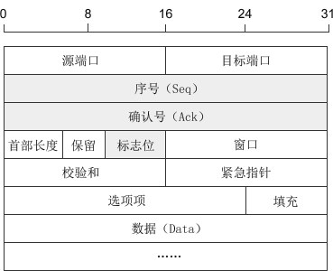

### TCP过程

1. 建立连接三次握手 （http://c.biancheng.net/view/2352.html）
2. 数据传输  （http://c.biancheng.net/view/2352.html）
3. 断开连接四次挥手（http://c.biancheng.net/view/2353.html）

### TCP数据报的结构

**端口号**

源端口号：发生请求的端口号是随机的 1024-49151之间，因为 0-1023 属于**公认端口**

目标端口号：服务器的端口号

####  序号

1) 序号：Seq（Sequence Number）序号占32位，用来标识从计算机A发送到计算机B的数据包的序号，计算机发送数据时对此进行标记。

2) 确认号：Ack（Acknowledge Number）确认号占32位，客户端和服务器端都可以发送，Ack = Seq + 1。

3) 标志位：每个标志位占用1Bit，共有6个，分别为 URG、ACK、PSH、RST、SYN、FIN，具体含义如下：

- URG：紧急指针（urgent pointer）有效。
- ACK：确认序号有效。
- PSH：接收方应该尽快将这个报文交给应用层。
- RST：重置连接。
- SYN：建立一个新连接。
- FIN：断开一个连接。

Seq 是 Sequence 的缩写，表示序列；

Ack(ACK) 是 Acknowledge 的缩写，表示确认；

SYN 是 Synchronous 的缩写，愿意是“同步的”，这里表示建立同步连接；

FIN 是 Finish 的缩写，表示完成

### TCP的三次握手

TCP三次握手的目的是建立可靠的通信信道

而三次握手最主要的目的就是双方确认自己与对方的发送和接收是正常的

TCP在数据传输之前需要先建立连接

这个连接的建立需要发送3个报文来完成连接的建立 

SYN：同步序列编号（**Synchronize Sequence Numbers**）

SYN = 1 的报文段不能携带数据，但要消耗掉一个序号

#### 第一次握手：

客户端给服务端发送一个 SYN 报文，并指定客户端的初始化序列号seq ，此时客户端处于 SYN_SEND 状态 

SYN 报文内容：首部的同步位 SYN = 1，初始序号 Sequence number = x

#### 第二次握手：

服务端受到客户端的 SYN 报文后，会以自己的 SYN 报文作为应答，并且也是指定了自己的初始化序列号seq。

同时会把客户端的seq+1作为ACK的值，表示自己已经收到了客户端的SYN，此时服务器处于 SYN_REVD 状态

SYN报文内容：SYN = 0，ACK = 1， Sequence number = y, Acknowledgment number = x + 1

#### 第三次握手：

客户端受到 SYN 报文后，会发送一个 ACK 报文，把服务器的 seq + 1 作为自己Acknowledgment number的值，表明自己已经收到了 SYN 报文，此时客户端处于ESTABLISHED状态

服务器收到 ACK 报文后，也处于 ESTABLISHED状态。此时双方已经建立链接

#### 第 1 次握手

Client 什么都无法无法确认。虽然自己发送了 syn 数据，但是只要没收到 Server 端的 syn/ack 数据都无法确认自己的发送是否正常。

| Client    | 己方发送正常 | 己方接收正常 | 对方发送正常 | 对方接收正常 |
| --------- | ------------ | ------------ | ------------ | ------------ |
| 第1次握手 |              |              |              |              |
| 第2次握手 |              |              |              |              |
| 第3次握手 |              |              |              |              |

Server 确认：自己接收正常，对方发送正常

| Server    | 己方发送正常 | 己方接收正常 | 对方发送正常 | 对方接收正常 |
| --------- | ------------ | ------------ | ------------ | ------------ |
| 第1次握手 |              | √            | √            |              |
| 第2次握手 |              |              |              |              |
| 第3次握手 |              |              |              |              |

#### 第 2 次握手

Client 确认：自己发送正常、接收正常，对方发送正常、接收正常。**Client 确认状态完成**

| Client    | 己方发送正常 | 己方接收正常 | 对方发送正常 | 对方接收正常 |
| --------- | ------------ | ------------ | ------------ | ------------ |
| 第1次握手 |              |              |              |              |
| 第2次握手 | √            | √            | √            | √            |
| 第3次握手 |              |              |              |              |

Server 依旧只能确认：对方发送正常，自己接收正常。自己的发送和对面的接收还没得到确认

| Server    | 己方发送正常 | 己方接收正常 | 对方发送正常 | 对方接收正常 |
| --------- | ------------ | ------------ | ------------ | ------------ |
| 第1次握手 |              | √            | √            |              |
| 第2次握手 |              | √            | √            |              |
| 第3次握手 |              |              |              |              |

#### 第 3 次握手

Client 确认状态在第 2 次握手时已完成。

| Client    | 己方发送正常 | 己方接收正常 | 对方发送正常 | 对方接收正常 |
| --------- | ------------ | ------------ | ------------ | ------------ |
| 第1次握手 |              |              |              |              |
| 第2次握手 | √            | √            | √            | √            |
| 第3次握手 | √            | √            | √            | √            |

Server 确认：自己发送正常，接收正常，对方发送正常、接收正常。

| Server    | 己方发送正常 | 己方接收正常 | 对方发送正常 | 对方接收正常 |
| --------- | ------------ | ------------ | ------------ | ------------ |
| 第1次握手 |              | √            | √            |              |
| 第2次握手 |              | √            | √            |              |
| 第3次握手 | √            | √            | √            | √            |

### 连接的建立过程（三次握手）

使用 connect() 函数建立连接时，客户端和服务器端会相互发送三个数据包，请看下图：

客户端调用socket函数创建套接字后，因为没有建立连接，所以套接字处于`CLOSED`状态；服务器端调用 listen() 函数后，套接字进入`LISTEN`状态，开始监听客户端请求。

这个时候，客户端开始发起请求：

1: 当客户端调用 connect() 函数后，TCP协议会组建一个数据包，并设置 SYN 标志位，表示该数据包是用来建立同步连接的。同时生成一个随机数字 1000，填充“序号（Seq）”字段，表示该数据包的序号。完成这些工作，开始向服务器端发送数据包，客户端就进入了`SYN-SEND`状态。

2: 服务器端收到数据包，检测到已经设置了 SYN 标志位，就知道这是客户端发来的建立连接的“请求包”。服务器端也会组建一个数据包，并设置 SYN 和 ACK 标志位，SYN 表示该数据包用来建立连接，ACK 用来确认收到了刚才客户端发送的数据包。

服务器生成一个随机数 2000，填充“序号（Seq）”字段。2000 和客户端数据包没有关系。

服务器将客户端数据包序号（1000）加1，得到1001，并用这个数字填充“确认号（Ack）”字段。

服务器将数据包发出，进入`SYN-RECV`状态。

3: 客户端收到数据包，检测到已经设置了 SYN 和 ACK 标志位，就知道这是服务器发来的“确认包”。客户端会检测“确认号（Ack）”字段，看它的值是否为 1000+1，如果是就说明连接建立成功。

接下来，客户端会继续组建数据包，并设置 ACK 标志位，表示客户端正确接收了服务器发来的“确认包”。同时，将刚才服务器发来的数据包序号（2000）加1，得到 2001，并用这个数字来填充“确认号（Ack）”字段。

客户端将数据包发出，进入`ESTABLISED`状态，表示连接已经成功建立。

4: 服务器端收到数据包，检测到已经设置了 ACK 标志位，就知道这是客户端发来的“确认包”。服务器会检测“确认号（Ack）”字段，看它的值是否为 2000+1，如果是就说明连接建立成功，服务器进入`ESTABLISED`状态。

至此，客户端和服务器都进入了`ESTABLISED`状态，连接建立成功，接下来就可以收发数据了。

#### 说明

三次握手的关键是要确认对方收到了自己的数据包，这个目标就是通过“确认号（Ack）”字段实现的。计算机会记录下自己发送的数据包序号 Seq，待收到对方的数据包后，检测“确认号（Ack）”字段，看`Ack = Seq + 1`是否成立，如果成立说明对方正确收到了自己的数据包。

### 数据的传输过程

建立连接后，两台主机就可以相互传输数据了。如下图所示: 

上图给出了主机A分2次（分2个数据包）向主机B传递200字节的过程

首先，主机A通过1个数据包发送100个字节的数据，数据包的 Seq 号设置为 1200 （上一次三次握手中第二次的ack号 也就是上面的1001）

主机B为了确认这一点，向主机A发送 ACK 包，并将 Ack 号设置为 1301。

> 为了保证数据准确到达，目标机器在收到数据包（包括SYN包、FIN包、普通数据包等）包后必须立即回传ACK包，这样发送方才能确认数据传输成功
>
> 简单理解：收到包后要理解回传ACK包

此时 Ack 号为 1301 而不是 1201，原因在于 Ack 号的增量为传输的数据字节数。假设每次 Ack 号不加传输的字节数，这样虽然可以确认数据包的传输，但无法明确100字节全部正确传递还是丢失了一部分，比如只传递了80字节。因此按如下的公式确认 Ack 号：

> Ack号 = Seq号 + 传递的字节数 + 1
>
> 简单理解：Ack号确认已传递的大小，加一为了告诉对方下次要传递的 Seq 号

与三次握手协议相同，最后加 1 是为了告诉对方下次要传递的 Seq 号。

### 四次握手断开连接

建立连接需要三次握手，断开连接需要四次握手，可以形象的比喻为下面的对话：

- [Shake 1] 套接字A：“任务处理完毕，我希望断开连接。”
- [Shake 2] 套接字B：“哦，是吗？请稍等，我准备一下。”
- 等待片刻后……
- [Shake 3] 套接字B：“我准备好了，可以断开连接了。”
- [Shake 4] 套接字A：“好的，谢谢合作。”

客户端主动断开连接的场景：

建立连接后，客户端和服务器都处于`ESTABLISED`状态。这时，客户端发起断开连接的请求：

1) 客户端调用 close() 函数后，向服务器发送 FIN 数据包，进入`FIN_WAIT_1`状态。FIN 是 Finish 的缩写，表示完成任务需要断开连接。

2) 服务器收到数据包后，检测到设置了 FIN 标志位，知道要断开连接，于是向客户端发送“确认包”，进入`CLOSE_WAIT`状态。

注意：服务器收到请求后并不是立即断开连接，而是先向客户端发送“确认包”，告诉它我知道了，我需要准备一下才能断开连接。

3) 客户端收到“确认包”后进入`FIN_WAIT_2`状态，等待服务器准备完毕后再次发送数据包。

4) 等待片刻后，服务器准备完毕，可以断开连接，于是再主动向客户端发送 FIN 包，告诉它我准备好了，断开连接吧。然后进入`LAST_ACK`状态。

5) 客户端收到服务器的 FIN 包后，再向服务器发送 ACK 包，告诉它你断开连接吧。然后进入`TIME_WAIT`状态。

6) 服务器收到客户端的 ACK 包后，就断开连接，关闭套接字，进入`CLOSED`状态。

7) 客户端等待2MSL 时间后进入 CLOSED 状态

####  TIME_WAIT 状态的说明

最后一次发送 ACK包后进入 TIME_WAIT 状态，而不是直接进入 CLOSED 状态关闭连接，这是为什么呢？

客户端最后一次向服务器回传ACK包时，有可能会因为网络问题导致服务器收不到，服务器会再次发送 FIN 包，如果这时客户端完全关闭了连接，那么服务器无论如何也收不到ACK包了，所以客户端需要等待片刻、确认对方收到ACK包后才能进入CLOSED状态。那么，要等待多久呢？

数据包在网络中是有生存时间的，超过这个时间还未到达目标主机就会被丢弃，并通知源主机。

这称为报文最大生存时间（MSL，Maximum Segment Lifetime）。TIME_WAIT 要等待 2MSL 才会进入 CLOSED 状态。ACK 包到达服务器需要 MSL 时间，服务器重传 FIN 包也需要 MSL 时间，2MSL 是数据包往返的最大时间，如果 2MSL 后还未收到服务器重传的 FIN 包，就说明服务器已经收到了 ACK 包。

