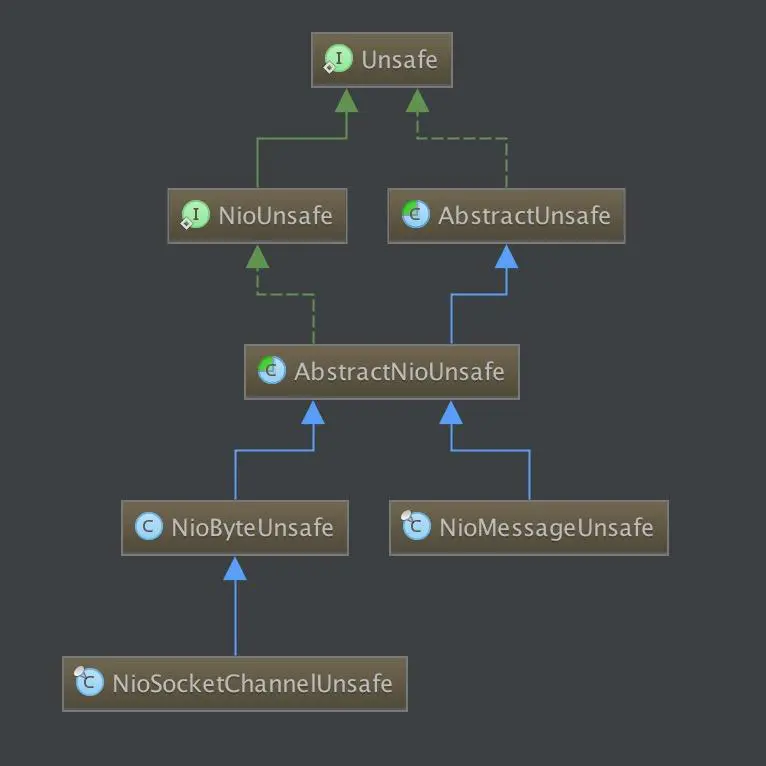
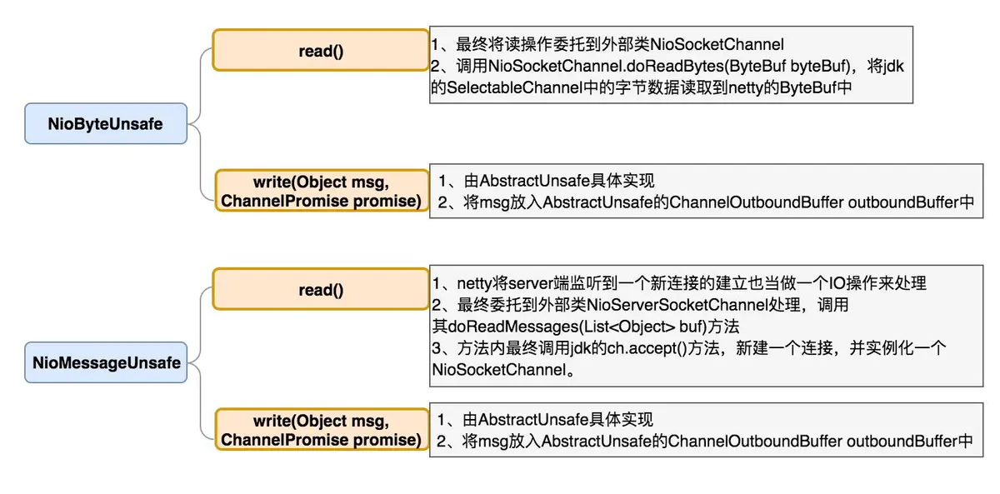

### unsafe的作用

Unsafe是Channel的内部类，一个Channel对应一个Unsafe。

Unsafe用于处理Channel对应网络IO的底层操作。ChannelHandler处理回调事件时产生的相关网络IO操作最终也会委托给Unsafe执行。


### unsafe的类继承结构

Unsafe接口中定义了socket相关操作，包括SocketAddress获取、selector注册、网卡端口绑定、socket建连与断连、socket写数据。这些操作都和jdk底层socket相关。

NioUnsafe在Unsafe基础上增加了几个操作，包括访问jdk的SelectableChannel、socket读数据等。

NioByteUnsafe实现了与socket连接的字节数据读取相关的操作。

NioMessageUnsafe实现了与新连接建立相关的操作。





### unsafe.read() 中 事件流转


服务端：

NioEventLoop.run 里调用processSelectedKey -->NioMessageUnsafe.read()

NioMessageUnsafe.read()里处理 accpet 得到的NioSocketChannel（默认最多循环16次得到16个NioSocketChannel）

给每条NioSocketChannel 传播 channelRead 事件

从Head节点的channelRead开始，然后到Head的下一个节点ServerBootstrapAcceptor里调用 channelRead 事件

ServerBootstrapAcceptor的channelRead主要三件事

1. 添加用户自定义的childHandler
2. 设置option和attr
3. 选择NioEventLoop注册selector
4. 向selector注册读事件

ServerBootstrapAcceptor的channelRead事件没有往下传播，就结束了


16个NioSocketChannel 都调用完成 channelRead 事件后（调用ServerBootstrapAcceptor.channelRead完成后）

传播 channelReadComplete 事件

从Head开始一直到Tail结束

服务端一般都是不关心channelReadComplete 事件

服务端一般只关心 channelActive ，channelRegistered，handlerAdded


ServerBootstrapAcceptor节点服务端才有，客户端是没有的


客户端：

NioEventLoop.run 里调用processSelectedKey -->NioByteUnsafe.read()

没对应的NioSocketChannel 分配好Buff，可能一次没有读完，需要读多次，最多16次

每读一次，就传播 channelRead 事件

从Head节点的channelRead开始，

然后到Head的下一个节点就到用户自定义的节点HttpServerCodec

接着到下一个节点HttpObjectAggregator

接着到下一个节点用户重写的SimpleChannelInboundHandler

这个节点调用 writeAndFlush 事件

先从SimpleChannelInboundHandler节点调用write 事件

write 事件从SimpleChannelInboundHandler节点网上传到HttpServerCodec，一直到Head节点（HttpObjectAggregator没有重写write）

在Head节点调用unsafe.write()，写人缓存链表

回到SimpleChannelInboundHandler节点调用flush事件

flush  事件从SimpleChannelInboundHandler节点网上传到HttpServerCodec，一直到Head节点

在Head节点调用unsafe.flush()，将缓存链表写到客户端


读完数据之后调用

传播 channelReadComplete 事件


### 读/写操作实现浅述




### NioEventLoop处理OP_READ事件 

代码入口: processSelectedKey

```java
private void processSelectedKey(SelectionKey k, AbstractNioChannel ch) {
    //上面省略...
    if ((readyOps & (SelectionKey.OP_READ | SelectionKey.OP_ACCEPT)) != 0 || readyOps == 0) {
        unsafe.read();
        if (!ch.isOpen()) {
            // Connection already closed - no need to handle write.
            return;
        }
    }
    //下面省略...
}
```


NioEventLoop在处理其selector监听到的OP_READ事件时，会将OP_READ事件最终交由Unsafe处理

即执行**NioByteUnsafe.read()**方法

```java
        @Override
        public final void read() {
            // 获取NioSocketChannel的配置信息
            final ChannelConfig config = config();
            // 获取NioSocketChannel的pipeline
            final ChannelPipeline pipeline = pipeline();
            // 获取缓存分配器-从池里获取内存
            final ByteBufAllocator allocator = config.getAllocator();
            //这个首次默认是2048从config里获取，赋值给unsafe，然后unsafe通过上次的大小来调整
            final RecvByteBufAllocator.Handle allocHandle = recvBufAllocHandle();
        
            allocHandle.reset(config);

            ByteBuf byteBuf = null;
            boolean close = false;
            try {
                do {
                    //根据recvBuf从池里分配内存-首次recvBuf默认是2048
                    //下次就会根据本次记录的大小去SIZE_TABLE里找合适的新值
                    byteBuf = allocHandle.allocate(allocator);
                    //将数据从nio.SocketChannel读取到byteBuf中
                    //实际调用了NioSocketChannel.doReadBytes(ByteBuf byteBuf)方法。
					//进一步调用ByteBuf.writeBytes(ScatteringByteChannel in, int length)方法。
					//最终底层调用nio的ReadableByteChannel.read(ByteBuffer dst)方法。
                    //lastBytesRead 同时记住读取到的大小，然后重新从SIZE_TABLE（一个16B递增的大小里面获取到还合适的大小）
                    //然后下次就重新赋值给unsafe.recvBufAllocHandle调整大小
                    allocHandle.lastBytesRead(doReadBytes(byteBuf));
                    //若本次读取到的数据长度==0，表示本次OP_READ事件的数据已读取完毕，退出循环
                    //若本次读取到的数据长度<0，表示对端已断开socket连接，退出循环，执行
                    if (allocHandle.lastBytesRead() <= 0) {
                        // nothing was read. release the buffer.
                        byteBuf.release();
                        byteBuf = null;
                        close = allocHandle.lastBytesRead() < 0;
                        break;
                    }
					//读次数加一
                    allocHandle.incMessagesRead(1);
                    readPending = false;
                    //触发ChannelRead事件，将读ByteBuf交给pipeline流转
                    pipeline.fireChannelRead(byteBuf);
                    //清空回收buff
                    byteBuf = null;
                    //两个判断
                    //1.读取个数是否小于最大阈值16次
                    //2.读到的是否小于byteBuf的最大值，小于则表示已经读完了
                } while (allocHandle.continueReading());
				//根据本次已读字节数，调整RecvByteBufAllocator的下次分配的缓存大小
                allocHandle.readComplete();
                //触发ChannelReadComplete事件，将读ByteBuf交给pipeline流转
                pipeline.fireChannelReadComplete();
				
                //客户端已断开socket连接
                if (close) {
                    //NioByteUnsafe.closeOnRead()方法关闭Channel，
                    //关闭Channel的过程中执行了pipeline.fireChannelInactive()和pipeline.fireChannelUnregistered()。
                    closeOnRead(pipeline);
                }
            } catch (Throwable t) {
                handleReadException(pipeline, byteBuf, t, close, allocHandle);
            } finally {
                // Check if there is a readPending which was not processed yet.
                // This could be for two reasons:
                // * The user called Channel.read() or ChannelHandlerContext.read() in channelRead(...) method
                // * The user called Channel.read() or ChannelHandlerContext.read() in channelReadComplete(...) method
                //
                // See https://github.com/netty/netty/issues/2254
                if (!readPending && !config.isAutoRead()) {
                    removeReadOp();
                }
            }
        }
```


### NioEventLoop处理OP_ACCEPT事件 

代码入口: processSelectedKey

```java
private void processSelectedKey(SelectionKey k, AbstractNioChannel ch) {
    //上面省略...
    if ((readyOps & (SelectionKey.OP_READ | SelectionKey.OP_ACCEPT)) != 0 || readyOps == 0) {
        unsafe.read();
        if (!ch.isOpen()) {
            // Connection already closed - no need to handle write.
            return;
        }
    }
    //下面省略...
}
```


NioEventLoop在处理其selector监听到的OP_READ事件时，会将OP_READ事件最终交由Unsafe处理

即执行**NioMessageUnsafe.read()**方法

```java

        @Override
        public void read() {
            // 必须是当前NioEventLoop线程调用
            assert eventLoop().inEventLoop();
            // 获取NioServerSocketChannel的配置信息
            final ChannelConfig config = config();
            // 获取NioServerSocketChannel的pipeline
            final ChannelPipeline pipeline = pipeline();
            // 获取缓存分配器
            final RecvByteBufAllocator.Handle allocHandle = unsafe().recvBufAllocHandle();
            allocHandle.reset(config);

            boolean closed = false;
            Throwable exception = null;
            try {
                try {
                    do {
                        //调用java底层channel.accept
						//将SocketChannel封装成NioSocketChannel放到List容器中
                        int localRead = doReadMessages(readBuf);
                        if (localRead == 0) {
                            break;
                        }
                        if (localRead < 0) {
                            closed = true;
                            break;
                        }
						//accept个数加一
                        allocHandle.incMessagesRead(localRead);
                        //判断是否大于阈值16次
                        //一个线程一次可以accpet16个Channel
                    } while (continueReading(allocHandle));
                } catch (Throwable t) {
                    exception = t;
                }

                int size = readBuf.size();
                for (int i = 0; i < size; i ++) {
                    readPending = false;
                    //NioServerSocketChannel对每一个NioSocketChannel传播ChannelRead事件
                    //会在NioServerSocketChannel特有的节点ServerBootstrapAcceptor里执行channelRead
                    //ServerBootstrapAcceptor的channelRead主要三件事;
                    //1. 添加用户自定义的childHandler
                    //2. 设置option和attr
                    //3. 选择NioEventLoop注册selector--
                    //   jdk底层注册selector，这时NioSocketChannel.SelectionKey的interestOps是0
                    //4. 向selector注册读事件
                    //   调用ServerBootstrapAcceptor.ChannelActive事件里修改NioSocketChannel.SelectionKey的interestOps为OP_READ
                    // NioServerSocketChannel本身是在int之后去注册selector
                    // NioServerSocketChannel在bind之后去调用ChannelActive事件修改NioServerSocketChannel.selectionKey为OP_ACCEPT
					// NioServerSocketChannel的注册在启动的时候确定
                    // NioSocketChannel的注册则是在ServerBootstrapAcceptor节点里执行
                    pipeline.fireChannelRead(readBuf.get(i));
                }
                readBuf.clear();
                //根据本次已读字节数，调整RecvByteBufAllocator的下次分配的缓存大小
                allocHandle.readComplete();
                //NioServerSocketChannel最后传播ChannelReadComplete事件
                pipeline.fireChannelReadComplete();

                if (exception != null) {
                    closed = closeOnReadError(exception);

                    pipeline.fireExceptionCaught(exception);
                }

                if (closed) {
                    inputShutdown = true;
                    if (isOpen()) {
                        close(voidPromise());
                    }
                }
            } finally {
                // Check if there is a readPending which was not processed yet.
                // This could be for two reasons:
                // * The user called Channel.read() or ChannelHandlerContext.read() in channelRead(...) method
                // * The user called Channel.read() or ChannelHandlerContext.read() in channelReadComplete(...) method
                //
                // See https://github.com/netty/netty/issues/2254
                if (!readPending && !config.isAutoRead()) {
                    removeReadOp();
                }
            }
        }
    }


	//调用java底层channel.accept
	//将SocketChannel封装成NioSocketChannel放到List容器中
    protected int doReadMessages(List<Object> buf) throws Exception {
        SocketChannel ch = SocketUtils.accept(javaChannel());

        try {
            if (ch != null) {
                buf.add(new NioSocketChannel(this, ch));
                return 1;
            }
        } catch (Throwable t) {
            logger.warn("Failed to create a new channel from an accepted socket.", t);

            try {
                ch.close();
            } catch (Throwable t2) {
                logger.warn("Failed to close a socket.", t2);
            }
        }

        return 0;
    }

```

